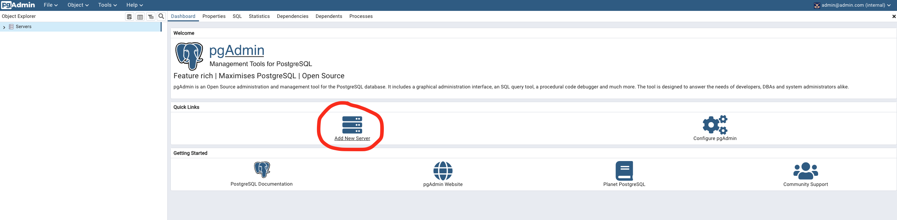
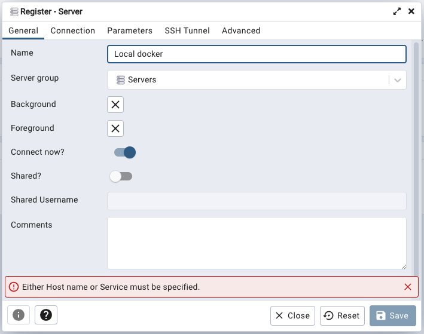
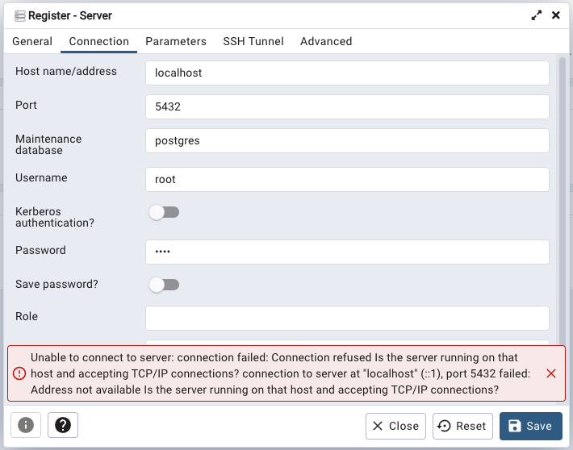
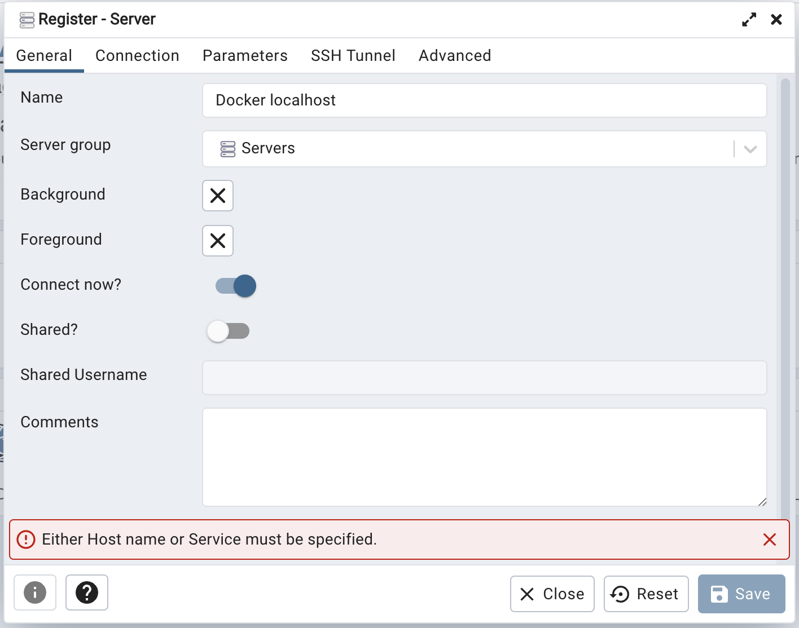
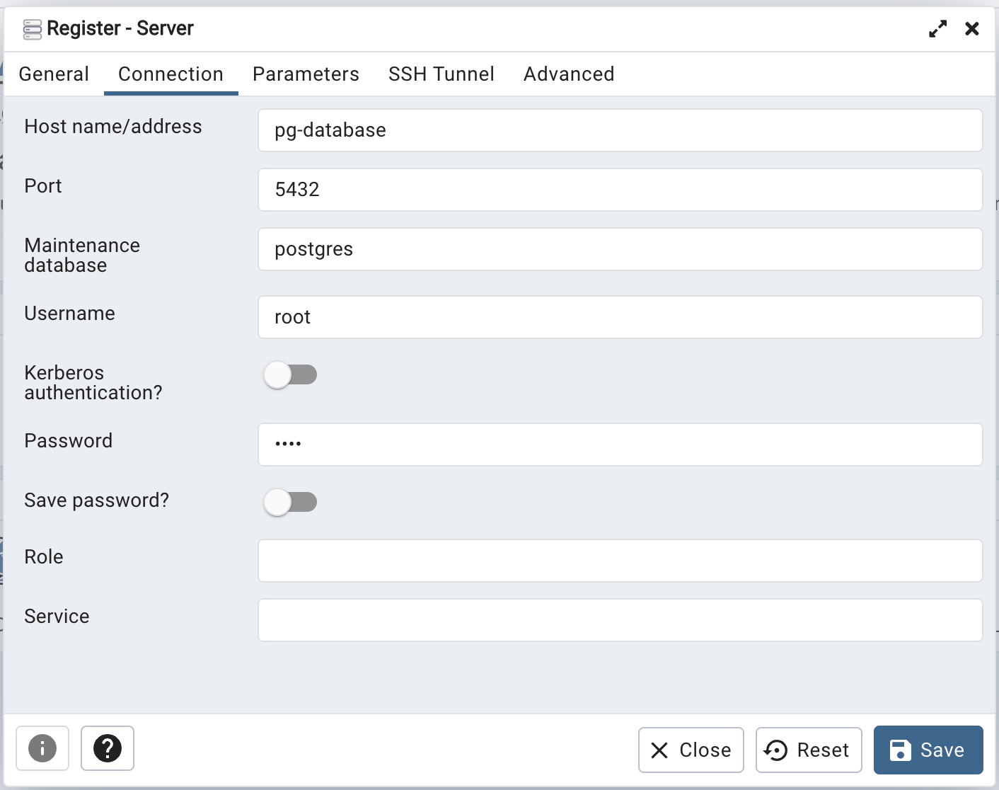
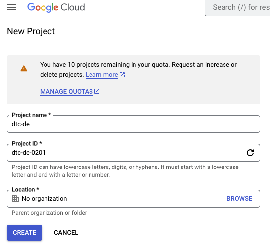
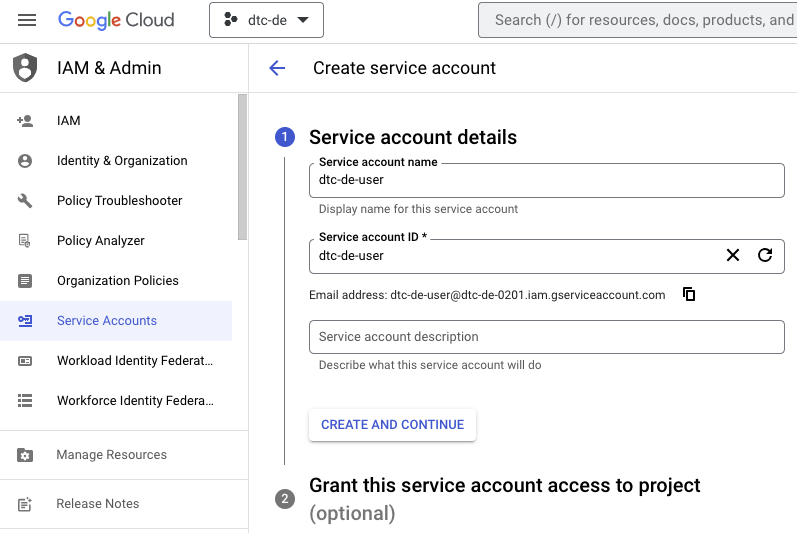
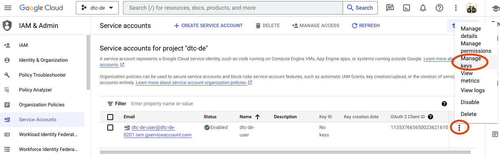

# Table of contents

- [DE Zoomcamp 1.2.1 - Introduction to Docker](#de-zoomcamp-111---introduction-to-google-cloud-platform)
- [DE Zoomcamp 1.2.2 - Investing NY Taxi Data to Postgres](#de-zoomcamp-122---investing-ny-taxi-data-to-postgres)
- [DE Zoomcamp 1.2.3 - Connecting pgAdmin and Postgres](#de-zoomcamp-123---connecting-pgadmin-and-postgres)
- [DE Zoomcamp 1.2.4 - Dockerizing the Ingestion Script](#de-zoomcamp-124---dockerizing-the-ingestion-script)
- [DE Zoomcamp 1.2.5 - Running Postgres and pgAdmin with Docker-Compose](#de-zoomcamp-125---running-postgres-and-pgadmin-with-docker-compose)
- [DE Zoomcamp 1.2.6 - SQL Refreshser](#de-zoomcamp-126---sql-refreshser)
- [DE Zoomcamp 1.3.1 - Introduction to Terraform Concepts & GCP Pre-Requisites](#de-zoomcamp-131---introduction-to-terraform-concepts--gcp-pre-requisites)
- [DE Zoomcamp 1.3.2 - Creating GCP Infrastructure with Terraform](#de-zoomcamp-132---creating-gcp-infrastructure-with-terraform)

# [DE Zoomcamp 1.2.1 - Introduction to Docker](https://www.youtube.com/watch?v=EYNwNlOrpr0&list=PL3MmuxUbc_hJed7dXYoJw8DoCuVHhGEQb&index=4)

- Why do we need Docker
- Creating a simple "data pipeline" in Docker

-it (interactive mode, i: interactive, t: terminal) => able to type something

> docker run -it ubuntu bash \
> docker run -it python:3.9

Have a bash prompt and can execute commands, e.g. _pip install pandas_

> docker run -it --entrypoint=bash python:3.9

When exit the prompt and execute the command above again -> import pandas -> there's no module named pandas -> since we run the container at the state before it's installed pandas. This particular image doesn't have pandas \

**=> Need something to make sure that the pandas library is there when we run our program => Using Dockerfile**

#### Dockerfile

```docker
# based image python ver 3.9.1
FROM python:3.9.1

# Run command to install pandas inside the container
# and it will create new image based on that
RUN pip install pandas

# Specify the working directory, which is the location in the container
# where the file will be copied to
WORKDIR /app

# Copy this file from current working directory to the docker image
# 1st argument: the name in the source on host machine
# 2nd argument: the name on the destination
COPY pipeline.py pipeline.py

# Overwrite entrypoint to get bash prompt (or execute python file)
# ENTRYPOINT ["bash"]
ENTRYPOINT ["python", "pipeline.py"]
```

Build docker image

> docker build -t <image_name>:<tag> . (. means docker searches for dockerfile in current directory and builds an image) \
> EX: docker build -t test:pandas .

Run docker image with passing arguments

> docker run -it test:pandas 2023-10-31

# [DE Zoomcamp 1.2.2 - Investing NY Taxi Data to Postgres](https://www.youtube.com/watch?v=2JM-ziJt0WI&list=PL3MmuxUbc_hJed7dXYoJw8DoCuVHhGEQb&index=5)

- Running Postgres locally with Docker
- Using `pgcli` for connecting to the database
- Exploring the NY Taxi dataset
  > [Yello trip data dictionary](https://www.nyc.gov/assets/tlc/downloads/pdf/data_dictionary_trip_records_yellow.pdf) \
  > **Note:** NYC TLC changed the format of the data we use to parquet. But you can still access the csv files [here](https://github.com/DataTalksClub/nyc-tlc-data).
- Ingesting the data into the database
- Note if you have problems with `pgcli`, check [this video](https://www.youtube.com/watch?v=3IkfkTwqHx4&list=PL3MmuxUbc_hJed7dXYoJw8DoCuVHhGEQb) for an alternative way to connect to your database

Use Postgres for simple tests in this section. \
Run a containerized version of Postgres that doesn't require any installation steps. \
Requirements: environment variables, a volume for storing data. \
Create a folder anywhere you'd like for Postgres to store data in. \
Example folder "ny_taxi_postgres_data".

#### Run this command to configurate Postgres for the container.

```bash
docker run -it \
  -e POSTGRES_USER="root" \
  -e POSTGRES_PASSWORD="root" \
  -e POSTGRES_DB="ny_taxi" \
  -v $(pwd)/data/ny_taxi_postgres_data:/var/lib/postgresql/data \
  -p 5432:5432 \
  postgres:13
```

- Image name and tag: postgres:13
- Environment variables: POSTGRES_USER, POSTGRES_PASSWORD, POSTGRES_DB, ...
- Volumes is a way of mapping folder that we have on our host machine to a folder in the container. Postgres is a database, it needs to keep files in a file system, where the records are saved in its specific format.
- **Remember docker doesn't keep the state, therefore, next time when docker is run, the state will be lost, results in the data is also lost => In order to keep data => mapping folder on host machine to a folder in the container is necessary => this is called MOUNTING.**

#### Tag explainations

- `-e` flag for setting environments variable in docker run
- `-v` flag for volumes. Pay attention to the path, docker needs a full path in a correct format (different path on Windows, Linux, Mac).
  - <_path to the folder in the host machine_>:<_path to the folder inside the container_>
  - `pwd`: command to show full path of current location. This command will only work if run it from a directory which contains the ny_taxi_postgres_data subdirectory.
- `-p` flag for port mapping. Map a port on host machine to a port in the container

#### Install library pgcli

Install this library to use this cli to access the Postgres database and run the queries.

> pip3 install psycopg psycopg-binary psycopg2-binary
> pip3 install pgcli

In order to log in to the database, some configurations need to be set up.

> pgcli --help \
> pgcli -h localhost -p 5432 -u root -d ny_taxi \
> Type in the password, which is "root" in this case

- `-h` flag: hostname (localhost if run locally).
- `-p` flag: port.
- `-u` flag: username.
- `-d` flag: database name.

Save 1000 rows from the original file to new file

> head -n 1000 yellow_tripdata_2021-01.csv > yellow_head.csv

Count number of rows in csv file

> wc -l yellow_tripdata_2021-01.csv

#### Python

```python
import pandas as pd
df = pd.read_csv('yellow_tripdata_2021-01.csv', nrows=1000)

# Convert dataframe to DDL (Data Definition Language)
# that is used for specifying the schema
print(pd.io.sql.get_schema(df, name='yellow_taxi_data'))

OUTPUT:

CREATE TABLE "yellow_taxi_data" (
"VendorID" INTEGER,
  "tpep_pickup_datetime" TEXT,
  "tpep_dropoff_datetime" TEXT,
  "passenger_count" INTEGER,
  "trip_distance" REAL,
  "RatecodeID" INTEGER,
  "store_and_fwd_flag" TEXT,
  "PULocationID" INTEGER,
  "DOLocationID" INTEGER,
  "payment_type" INTEGER,
  "fare_amount" REAL,
  "extra" REAL,
  "mta_tax" REAL,
  "tip_amount" REAL,
  "tolls_amount" REAL,
  "improvement_surcharge" REAL,
  "total_amount" REAL,
  "congestion_surcharge" REAL
)
```

# [DE Zoomcamp 1.2.3 - Connecting pgAdmin and Postgres](https://www.youtube.com/watch?v=hCAIVe9N0ow&list=PL3MmuxUbc_hJed7dXYoJw8DoCuVHhGEQb&index=7)

#### pgAdmin

- It's not convenient to use pgcli for data exploration and querying
- pgAdmin - the standard graphical tool for postgres for that https://www.pgadmin.org/download/pgadmin-4-container/
- Can run with docker
- Docker container can't access the postgres container => need to link them

```bash
docker run -it \
  -e PGADMIN_DEFAULT_EMAIL="admin@admin.com" \
  -e PGADMIN_DEFAULT_PASSWORD="root" \
  -p 8080:80 \
  dpage/pgadmin4
```

- `-e` flag: environment variables for logging into the interface.
- `-p` flag: port mapping, map port 8080 on localhost to port 80 on the container.
- `dpage/pgadmin4` name of the image.

Load pgAdmin on a web browser by url `localhost:8080` with the same email and password used for container.







<span style="color: red"> Unable to connect to server.</span> Reason for that:

- We are running pgAdmin inside a container and Postgres inside another container.
- That means the pgAdmin cannot find the Postgres.

**How can we connect those two containers???**

- We need to link the Postgres and the pgAdmin together by using `network`.
- Put those two containers in the same `network` => two containers can find each other.

#### Create docker network.

```
docker network create <network-name>
EX: docker network create pg-network
```

#### Postgres for the container running with network.

```bash
docker run -it \
  -e POSTGRES_USER="root" \
  -e POSTGRES_PASSWORD="root" \
  -e POSTGRES_DB="ny_taxi" \
  -v $(pwd)/data/ny_taxi_postgres_data:/var/lib/postgresql/data \
  -p 5432:5432 \
  --network=pg-network \
  --name pg-database \
  postgres:13
```

#### pgAdmin for the container running with network.

```bash
docker run -it \
  -e PGADMIN_DEFAULT_EMAIL="admin@admin.com" \
  -e PGADMIN_DEFAULT_PASSWORD="root" \
  -p 8080:80 \
  --network=pg-network \
  --name pgadmin \
  dpage/pgadmin4
```

- `--network`: name of docker network.
- `--name`: name for other containers to find this Postgres.





# [DE Zoomcamp 1.2.4 - Dockerizing the Ingestion Script](https://www.youtube.com/watch?v=B1WwATwf-vY&list=PL3MmuxUbc_hJed7dXYoJw8DoCuVHhGEQb&index=9)

#### Converting the Jupyter notebook to a Python script

> jupyter nbconvert --to=script upload-data.ipynb

#### Parametrizing the script with argparse

Using `argparse` to handle the following command line arguments:

- Username
- Password
- Host
- Port
- Database name
- Table name
- URL for the CSV file

Test python the script, need to drop the table yellow_taxi_data previously created.

```bash
python3 ingest_data.py \
  --user=root \
  --password=root \
  --host=localhost \
  --port=5432 \
  --db=ny_taxi \
  --table_name=yellow_taxi_trips \
  --url="https://github.com/DataTalksClub/nyc-tlc-data/releases/download/yellow/yellow_tripdata_2021-01.csv.gz"
```

#### Dockerizing the ingestion script

Let's modify the Dockerfile before to include ingest_data.py script and create a new image

```bash
# based image python ver 3.9
FROM python:3.9

# Install wget to download the csv file
RUN apt-get install wget

# Run command to install pandas inside the container
# and it will create new image based on that
# psycopg2 is a postgres db adapter for python: sqlalchemy needs it
RUN pip install pandas sqlalchemy psycopg2

# Specify the working directory, which is the location in the container
# where the file will be copied to
WORKDIR /app

# Copy this file from current working directory to the docker image
# 1st argument: the name in the source on host machine
# 2nd argument: the name on the destination
COPY ingest_data.py ingest_data.py

# Overwrite entrypoint to get bash prompt (or execute python file)
# ENTRYPOINT ["bash"]
ENTRYPOINT ["python", "ingest_data.py"]
```

Build docker image

> docker build -t taxi_ingest:v001 .

Run with docker command

```bash
docker run -it \
  --network=pg-network \
  taxi_ingest:v001 \
  --user=root \
  --password=root \
  --host=pg-database \
  --port=5432 \
  --db=ny_taxi \
  --table_name=yellow_taxi_trips \
  --url="https://github.com/DataTalksClub/nyc-tlc-data/releases/download/yellow/yellow_tripdata_2021-01.csv.gz"
```

- `-it` to stop the docker run in terminal. Otherwise it will not be interactive.
- `host` if use `localhost` when running in docker, localhost itself has no postgresql => will be failed. Use pg-database to connect with Postgres database in the network.
- Need to run within `network`, which should be specified before image name.
- Before image name, parameters are for Docker. After image name, parameters are for application.

#### Trick to make docker run faster

Run http server with python to list all the files in the current directory

> python3 -m http.server

Check for IP address

> ifconfig / ipconfig

=> let docker download the data file `yellow_tripdata_2021-01.csv` from your IP address. By setting the URL to the local path of the file.

Change to `os.system(f"wget {url} -O {csv_name}")` in ingest_data.py

```bash
docker run -it \
  --network=pg-network \
  taxi_ingest:v001 \
  --user=root \
  --password=root \
  --host=pg-database \
  --port=5432 \
  --db=ny_taxi \
  --table_name=yellow_taxi_trips \
  --url="http://192.168.1.42:8000/yellow_tripdata_2021-01.csv"
```

# [DE Zoomcamp 1.2.5 - Running Postgres and pgAdmin with Docker-Compose](https://www.youtube.com/watch?v=hKI6PkPhpa0&list=PL3MmuxUbc_hJed7dXYoJw8DoCuVHhGEQb&index=9)

- Why do we need Docker-compose?
- Docker-compose YAML file
- Running multiple containers with docker-compose up

`docker-compose`: put configuration from multiple containers using a single file => don't need to run multiple complex docker run commands separately.

Here's the docker-compose.yaml file for running the Postgres and pgAdmin containers:

```yaml
services:
  pg-database:
    image: postgres:13
    environment:
      - POSTGRES_USER=root
      - POSTGRES_PASSWORD=root
      - POSTGRES_DB=ny_taxi
    volumes:
      - "../../../data/ny_taxi_postgres_data:/var/lib/postgresql/data:rw"
    ports:
      - "5432:5432"
  pgadmin:
    image: dpage/pgadmin4
    environment:
      - PGADMIN_DEFAULT_EMAIL=admin@admin.com
      - PGADMIN_DEFAULT_PASSWORD=root
    volumes:
      - "../../../data/pgadmin_data:/var/lib/pgadmin"
    ports:
      - "8080:80"
```

- `pgadmin` is able to access postgres `pg-database` since we already defined them in the `docker-compose` file. \
  => They automatically become a part of the same network => we don't need to create a `network`.
- For `volumes` in docker-compose, don't need to write the full path. `rw` stands for `read-write`, which is the default one.
- Since the settings for pgAdmin were stored within another container and we have killed the that one => we have to re-create the connection by following the steps [here](#pgadmin-for-the-container-running-with-network).

  - Added a volume for pgAdmin to save its settings => don't have to keep re-creating the connection to Postgres every time re-run the container.
  - Volumes is a way of mapping folder that we have on our host machine to a folder in the container.
  - Remember docker doesn't keep the state, therefore, next time when docker is run, the state will be lost, results in the data is also lost => In order to keep data => mapping folder on host machine to a folder in the container is necessary => this is called MOUNTING.
  - Create a `pgadmin_data` folder in `data` work folder (should be the same location with `ny_taxi_postgres_data`).
  - Run docker-compose for the first time & the configuration for connecting to Postgres will be stored in `pgadmin_data`.

Running docker-compose in the same directory where docker-compose.yaml \
**Make sure all previous containers are stopped.**

> docker-compose up

Running docker-compose in `detached` mode => can still do commands with the current terminal.

> docker-compose up -d

Stopping docker-compose

> Ctrl + C or docker-compose down

# [DE Zoomcamp 1.2.6 - SQL Refreshser](https://www.youtube.com/watch?v=QEcps_iskgg&list=PL3MmuxUbc_hJed7dXYoJw8DoCuVHhGEQb&index=13)

- Adding the Zones table
  - The Zones table data can be downloaded from [here](https://www.nyc.gov/site/tlc/about/tlc-trip-record-data.page).
  - Upload this data to ny_taxi database.
- Inner joins
- Basic data quality checks
- Left, Right and Outer joins
- Group by

#### Optional: If having problems with docker networking,check [DE Zoomcamp 1.4.2 - Port Mapping and Networks in Docker (Bonus)](https://www.youtube.com/watch?v=tOr4hTsHOzU&list=PL3MmuxUbc_hJed7dXYoJw8DoCuVHhGEQb)

- Docker networks
- Port forwarding to the host environment
- Communicating between containers in the network
- `.dockerignore` file

#### Optional: If want to do the steps from `DE Zoomcamp 1.2.2 - Investing NY Taxi Data to Postgres` to `DE Zoomcamp 1.2.5 - Running Postgres and pgAdmin with Docker-Compose` with Windows Subsystem Linux => check [Docker Module Walk-Through on WSL](https://www.youtube.com/watch?v=Mv4zFm2AwzQ)

### SQL commands can be categorized into the following categories:

- DDL: Data Definition Language.
  - Define the database schema (create, modify, destroy)
  - CREATE, DROP, ALTER, TRUNCATE, COMMENT, RENAME
- DQL: Data Query Language.
  - Perform queries on the data within schema objects. Get data from the database and impose order upon it.
  - SELECT
- DML: Data Manipulation Language.
  - Manipulates data present in the database.
  - INSERT, UPDATE, DELETE, LOCK...
- DCL: Data Control Language.
  - Rights, permissions and other controls of the database system.
  - Usually grouped with DML commands.
  - GRANT, REVOKE
- TCL: Transaction Control Language.
  - Transactions within the database.
  - Not a universally considered category.
  - COMMIT, ROLLBACK, SAVEPOINT, SET TRANSACTION

# [DE Zoomcamp 1.3.1 - Introduction to Terraform Concepts & GCP Pre-Requisites](https://www.youtube.com/watch?v=Hajwnmj0xfQ&list=PL3MmuxUbc_hJed7dXYoJw8DoCuVHhGEQb&index=11)

## Terraform Overview

Installation: https://developer.hashicorp.com/terraform/tutorials/aws-get-started/install-cli

1. What is Terraform?

- Open-source tool used for provisionning and infrastructure resources.
- Supports DevOps best practices for change management.
- Managing configuration files in source control to manintain an ideal provisioning state for testing and production environments.

2. What is Iac?

- Infrastructure-as-Code.
- Build, change, and manage your infrastructure in a safe, consistent, and repeatable way by defining resource configurations that you can version, reuse, and share.

3. Some advantages

- Simplicity in keeping track of infrastructure.
- Easier collaboration.
- Reproducibility.
- Ensure resources are removed.
- Infrastructure lifecycle management.
- Version control commits.
- Very useful for stack-based deployments, and with cloud providers such as AWS, GCP, Azure, K8S, ...
- State-based approach to track resource changes throughout deployments.

## Google Cloud Platform (GCP)

#### [DE Zoomcamp 1.1.1 - Introduction to Google Cloud Platform](https://www.youtube.com/watch?v=18jIzE41fJ4&list=PL3MmuxUbc_hJed7dXYoJw8DoCuVHhGEQb&index=3)

- Cloud computing services offered by google.
- Includes a range of hosted services for compute, storage and application development that run on Google hardware.
- Same hardware on which google runs its service.

For this course, use a free version (upto 300 Euro credits).

1. Create an account with Google email ID.

2. Setup first `project`, eg. "dtc-de" and note down the "Project ID". This "Project ID" must be unique to all of GCP. Leave the organization as No organization.

   

3. Setup `service account & authentication` for project, download auth-keys (json).

   - Go to `IAM & Admin` -> `Service Accounts` -> `Create Service Account`.

     

   - Grant the `Viewer` role (Basic > Viewer) to the service account and click on Continue.
   - There is no need to grant users access to this service account at the moment. Click on Done.
   - when service accounts is generated. click on the `Actions` -> `Manage Keys` -> `Add Key` -> `Create new key` -> `JSON` -> A file access key will be downloaded.

     

4. Download SDK for local setup. Google SDK is a CLI tool, which is used to interact with cloud services. Download [GCP SDK](https://cloud.google.com/sdk/docs/install-sdk).

5. Set environment variable to point to your downloaded GCP auth-keys:

```bash
export GOOGLE_APPLICATION_CREDENTIALS="<path/to/your/service-account-authkeys>.json"

export GOOGLE_APPLICATION_CREDENTIALS="/Users/hoang.hai.pham/Documents/code/Tutorials/DataEngineer/data/gcp_credentials/hpham-dtc-de-4fb77b95f342.json"

# Check gcloud version
gcloud -v

# Refresh token, and verify authentication
gcloud auth application-default login
```

## Create infrastructure for project with Terraform

### Project infrastructure modules in GCP

- Google Cloud Storage (GCS): Data Lake.
- BigQuery: Data Warehouse.

### Setup Access

1. `IAM Roles` for Service Account" \
   Storage Admin, Storage Object Admin, BigQuery Admin, Viewer.

   - Go to `IAM & Admin` -> `IAM` in GCP dashboard.
   - Click `Edit` for the newly selected Service Account.
   - Add following roles -> Save:
     - Storage Admin: for creating and managing buckets.
     - Storage Object Admin: for creating and managing objects within the buckets.
     - BigQuery Admin: for managing BigQuery data.
     - Viewer

2. Enable `IAM` and `IAMCredentials` APIs for project. This is necessary so that Terraform can interact with GCP. Make sure that select the correct `Project.`

   - https://console.cloud.google.com/apis/library/iam.googleapis.com
   - https://console.cloud.google.com/apis/library/iamcredentials.googleapis.com

3. Ensure `GOOGLE_APPLICATION_CREDENTIALS` env-var is set.

```bash
export GOOGLE_APPLICATION_CREDENTIALS="<payh/to/your/service-account-authkeys>.json"

export GOOGLE_APPLICATION_CREDENTIALS="/Users/hoang.hai.pham/Documents/code/Tutorials/DataEngineer/data/gcp_credentials/hpham-dtc-de-4fb77b95f342.json"
```

# [DE Zoomcamp 1.3.2 - Creating GCP Infrastructure with Terraform](https://www.youtube.com/watch?v=dNkEgO-CExg&list=PL3MmuxUbc_hJed7dXYoJw8DoCuVHhGEQb&index=13)

Terraform loads all files ending in .tf or .tf.json in the working directory. A Terraform configuration must be in its own working directory; you cannot have 2 or more separate configurations in the same folder.

The [Terraform tutorial with GCP](https://developer.hashicorp.com/terraform/tutorials/gcp-get-started/google-cloud-platform-build) shows a basic `main.tf` file written in Terraform language with all of the necesary info to describe basic infrastructure.

- Terraform divides information into blocks with {}.

- There are 3 main blocks: terraform, provider and resource. There must only be a single terraform block but there may be multiple provider and resource blocks.

- The `terraform` block contains settings:

  - The `required_providers` sub-block specifies the providers required by the configuration (`google` in the example).
  - The provider (google) is a plugin that Terraform uses to create and manage resources. Each provider needs a source in order to install the right plugin.
  - By default the Hashicorp repository is used, in a similar way to Docker images. `hashicorp/google` is short for registry.terraform.io/hashicorp/google .
  - Optionally, a provider can have an enforced `version`. If this is not specified the latest version will be used by default.

- The `provider` block configures a specific provider.

  - The contents of a provider block are provider-specific. The contents in this example are meant for GCP but may be different for AWS or Azure.

- The `resource` blocks define the actual components of infrastructure.

  > resource "type" "name"

  - Resource type:

    - The first prefix of the resource type maps to the name of the provider. For example, the resource type `google_storage_bucket` has the prefix `google` and thus maps to the provider google.
    - The resource types are defined in the Terraform documentation and refer to resources that cloud providers offer. Example [google_storage_bucket](https://registry.terraform.io/providers/hashicorp/google/latest/docs/resources/storage_bucket).

  - Resource name: the internal name that is used in Terraform configurations to refer to each resource and have no impact on the actual infrastructure.

  - The contents of a resource block are specific to the resource type. Check the [Terraform docs](https://registry.terraform.io/browse/providers) to see a list of resource types by provider.

Variables must be accessed with the keyword var. and then the name of the variable. Those variables are stored in `variables.tf` file.

- `Local` values block types behave more like constants.

  - Local values may be grouped in one or more blocks of type locals. Local values are often grouped according to usage.
  - Local values are simpler to declare than input variables because they are only a key-value pair.
  - Local values must be accessed with the word `local`.
    > region = local.region

- Select the region within the location where you're living. And should be the same region for all resouces.

- If different regions are selected, it will cost more money when those regions communicate with each other.

With a configuration ready, there are several commands that must be followed:

- `terraform init`: initialize & install the necessary providers/plugins.
- `terraform fmt` (optional): formats your configuration files so that the format is consistent.
- `terraform validate` (optional): returns a success message if the configuration is valid and no errors are apparent.
- `terraform plan`: creates a preview of the changes to be applied against a remote state, allowing you to review the changes (old resources deleted, new resource creates, existing resource updated) before applying them => Enter `project ID` after running this command.
- `terraform apply`: applies the changes to the infrastructure => Enter `project ID` > `yes` after running this command.
- `terraform destroy`: removes your stack from the infrastructure to avoid cost.

# Extra content

Setting up a development environment in a Google Cloud VM
If you cannot set up a local development environment, you may use part of the $300 credits of GCP in creating a Cloud VM and access to it via SSH to set up the environment there.

Follow the instructions [DE Zoomcamp 1.4.1 - Setting up the Environment on Google Cloud (Cloud VM + SSH access)](https://www.youtube.com/watch?v=ae-CV2KfoN0&list=PL3MmuxUbc_hJed7dXYoJw8DoCuVHhGEQb&index=16)

Port mapping and networks in Docker
If you're having issues with Docker and networking (especially if you already have Postgres running locally in your host computer), a videoguide is also available. [DE Zoomcamp 1.4.2 - Port Mapping and Networks in Docker (Bonus)](https://www.youtube.com/watch?v=tOr4hTsHOzU&list=PL3MmuxUbc_hJed7dXYoJw8DoCuVHhGEQb&index=17)
