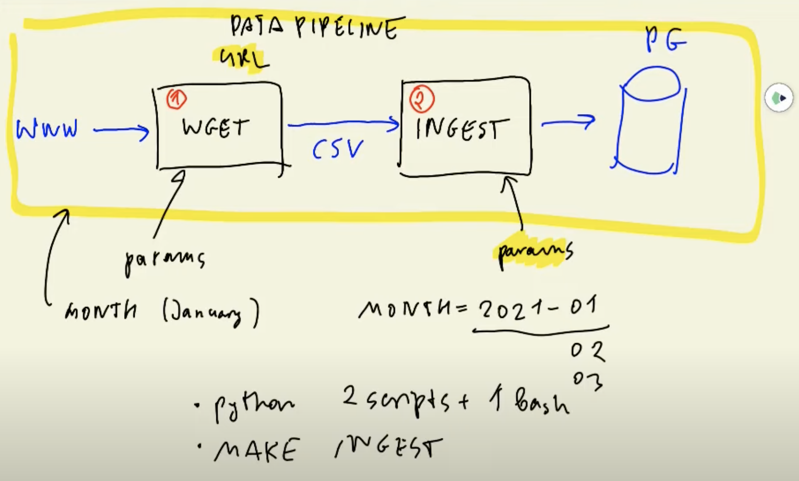
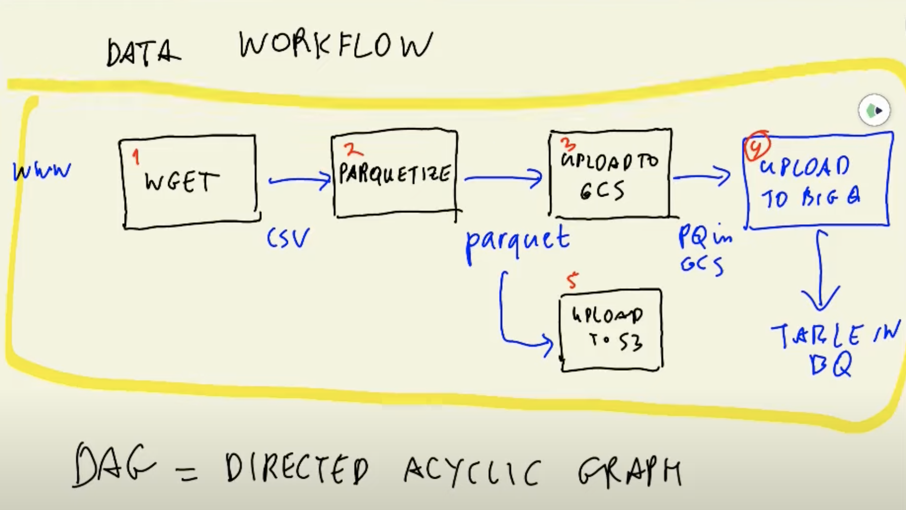
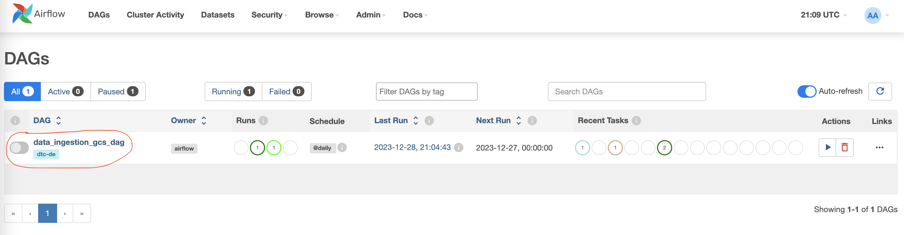

# With Airflow

# [DE Zoomcamp 2.1.1 - Data Lake](https://www.youtube.com/watch?v=W3Zm6rjOq70&list=PL3MmuxUbc_hJed7dXYoJw8DoCuVHhGEQb&index=20)

- What is a Data Lake
- ELT vs. ETL
- Alternatives to components (S3/HDFS, Redshift, Snowflake etc.)

### What is a Data Lake?

- A Data Lake is a central repository that holds big data from many sources.
- The data in a Data Lake could either be structured, unstructured or a mix of both.
- The main goal behind a Data Lake is being able to ingest data as quickly as possible and making it available to the other team members.
- A Data Lake should be: Secure, Scalable, Able to run on inexpensive hardware

### Data Lake vs Data Warehouse

There are several differences between Data Lake & Data Warehouse:

- Data Lake (DL)
  - The data is raw and has undergone minimal processing. The data is generally unstructured.
  - It stores huge amount of data (upto petabytes).
  - Use cases: stream processing, machine learning, and real-time analytics.
- Data Warehouse (DW)
  - The data is refined; it has been cleaned, pre-processed and structured for specific use cases.
  - Data is small in comparison with DLs. Data is always preprocessed before ingestion and may be purged periodically.
  - Use cases: batch processing, BI reporting.

How did DL start when everybody already has DW?

- Companies realized the value of data.
- Store and access data quickly.
- Cannot always define structure of data.
- Usefulness of data being realized later in the project lifecycle.
- Increase in data scientists.
- R&D on data products.
- Need for Cheap storage of Big data.

### ETL vs ELT

- Export Transform and Load (ETL)
  - ETL is mainly used for a small amount of data (DW solution).
  - ETL (schema on write) means the data is transformed (preprocessed, etc), defined schema & relationships before arriving to its final destination.
- Export Load and Transform (ELT).
  - ELT is used for large amount of data (DL solution).
  - ELT (schema on read) means the data is directly stored without any transformations and any schemas are determined when reading the data.

### Gotcha of Data Lake

Data Lakes are only useful if data can be easily processed from it. However, if DL converts into Data Swamp, which makes it very hard to be useful. There are serveral reasons that convert DL into Data Swamp:

- No versioning.
- Incompatible schemas for same data without versioning.
- No metadata associated.
- Joins between different datasets are not possible.

### Cloud provider Data Lake

- GCP - cloud storage
- AWS - S3
- Azure - Azure blob

# [DE Zoomcamp 2.2.1 - Introduction to Workflow orchestration](https://www.youtube.com/watch?v=0yK7LXwYeD0&list=PL3MmuxUbc_hJed7dXYoJw8DoCuVHhGEQb&index=18)

- What is an Orchestration Pipeline?
- What is a DAG?

Workflow orchestration means governing your data flow in a way that respects orchestration rules and your business logic.

Workflow orchestration helps to turn any code into a workflow that you can schedule, run & observe.

In the previous lesson we saw the definition of data pipeline and we created a pipeline script that downloaded a CSV and processed it so that we could ingest it to Postgres.


The script we created is an example of how NOT to create a pipeline, because it contains 2 steps which could otherwise be separated (downloading and processing). The reason is that if our internet connection is slow or if we're simply testing the script, it will have to download the CSV file every single time that we run the script, which is less than ideal.

Ideally, each of these steps would be contained as separate entities, like for example 2 separate scripts. For our pipeline, that would look like this:

> (web) → DOWNLOAD → (csv) → INGEST → (Postgres)



We have now separated our pipeline into a DOWNLOAD script and a INGEST script.

In this lesson we will create a more complex pipeline:



`Parquet` is a columnar storage datafile format which is more effective way of storing data than CSV.

This Data Workflow has more steps and even branches. This type of workflow is often called a `Directed Acyclic Graph (DAG)` because it lacks any loops and the data flow is well defined.

- Directed: the jobs need to be executed in order, we know which job depends on which one.
- Acyclic: means there are no cycles, no loops.

The steps in capital letters are our jobs and the objects in between are the jobs' outputs, which behave as dependencies for other jobs. Each job may have its own set of parameters and there may also be global parameters which are the same for all of the jobs.

A Workflow Orchestration Tool allows us to define data workflows and parametrize them; it also provides additional tools such as history and logging.

The tool we will focus on in this course is `Apache Airflow`, but there are many others such as Luigi, Prefect, Argo, etc.

# [DE Zoomcamp 2.3.1 - Setup Airflow Environment with Docker-Compose](https://www.youtube.com/watch?v=lqDMzReAtrw&list=PL3MmuxUbc_hJed7dXYoJw8DoCuVHhGEQb&index=19)

### Airflow Architecture


Ref: https://airflow.apache.org/docs/apache-airflow/stable/concepts/overview.html

- `Web server`: GUI to inspect, trigger and debug the behaviour of DAGs and tasks. Available at http://localhost:8080.
- `Scheduler`: Responsible for scheduling jobs. Handles both triggering & scheduled workflows, submits Tasks to the executor to run, monitors all tasks and DAGs, and then triggers the task instances once their dependencies are complete.
- `Executor` handles running tasks. In a default installation, the executor runs everything inside the scheduler but most production-suitable executors push task execution out to workers.
- `Worker`: This component executes the tasks given by the scheduler.
- `Metadata database (postgres)`: Backend to the Airflow environment. Used by the scheduler, executor and webserver to store state.
- A `DAG directory`: a folder with DAG files which is read by the scheduler and the executor (an by extension by any worker the executor might have)
- Other components (seen in docker-compose services):
  - `redis`: Message broker that forwards messages from scheduler to worker.
  - `flower`: The flower app for monitoring the environment. It is available at http://localhost:5555.
  - `airflow-init`: initialization service (customized as per this design)

All these services allow you to run Airflow with CeleryExecutor.

### Airflow will create a folder Project Structure when running:

- `./dags` - DAG_FOLDER for DAG files (use ./dags_local for the local ingestion DAG).
- `./logs` - contains logs from task execution and scheduler.
- `./plugins` - for custom plugins.

### Workflow components

- `DAG`: Directed acyclic graph, specifies the dependencies between a set of tasks with explicit execution order, and has a beginning as well as an end. (Hence, “acyclic”)

  - DAG Structure: DAG Definition, Tasks (eg. Operators), Task Dependencies (control flow: >> or << )

- `Task`: a defined unit of work (aka, operators in Airflow). The Tasks themselves describe what to do, be it fetching data, running analysis, triggering other systems, or more. Common Types of tasks are:

  - Operators (used in this workshop) are predefined tasks. They're the most common.
  - Sensors are a subclass of operator which wait for external events to happen.
  - TaskFlow decorators (subclasses of Airflow's BaseOperator) are custom Python functions packaged as tasks.

- `DAG Run`: individual execution/run of a DAG. A run may be scheduled or triggered.

- `Task Instance`: an individual run of a single task. Task instances also have an indicative state, which could be “running”, “success”, “failed”, “skipped”, “up for retry”, etc.

  - Ideally, a task should flow from `none`, to `scheduled`, to `queued`, to `running`, and finally to `success`.

### Pre-requisites

1. For the skae of standardization across this tutorial's config:

- rename the `gcp-service-accounts-credentials` file to `google_credentials.json`.
- Store it ini `$HOME` directory.

```bash
cd ~ && mkdir -p ~/.google/credentials/
cp /Users/hoang.hai.pham/Documents/code/Tutorials/DataEngineer/data/dtc-de-0201-8eee0a0ef1ac.json ~/.google/credentials/google_credentials.json

```

2. Upgrade docker-compose version to v2.x+ & set the memory for Docker Engine to minimum 5GB (ideally 8GB). If enough memory is not allocated, it might lead to airflow-webserver continuously restarting. On Docker Desktop this can be changed in `Setting > Resources > Advanced`.

### Setup (full version)

Please follow these instructions for deploying the "full" Airflow with Docker. Instructions for a "lite" version are provided in the next section but you must follow these steps first.

1. Create a new sub-directory called `airflow` in your project dir.

2. Import the official image & setup from the latest Airflow version:

   > curl -LfO 'https://airflow.apache.org/docs/apache-airflow/2.8.0/docker-compose.yaml'

   - The official docker-compose.yaml file is quite complex and contains [several service definitions](https://airflow.apache.org/docs/apache-airflow/stable/howto/docker-compose/index.html).

3. Setup the Airflow user:

- On Linux, the quick start needs to know your host user=id and needs to have group id set to 0. Otherwise the files created in `dags`, `logs`, and `plugins` will be created with root user. You have to make sure to configure them for the docker-compose
  > mkdir -p ./dags ./logs ./plugins (for blanks setup) \
  > echoe -e "AIRFLOW_UID=$(id -u)" > .env
- For MacOS, create a new `.env` in the same folder as the docker-compose.yaml file with the content below:

4. The base Airflow Docker image won't work with GCP, so we need to [customize it](https://airflow.apache.org/docs/docker-stack/build.html) to suit our needs. You may download a GCP-ready [Airflow Dockerfile](https://github.com/DataTalksClub/data-engineering-zoomcamp/blob/main/cohorts/2022/week_2_data_ingestion/airflow/Dockerfile). A few things of note:

- Use the base Apache Airflow image as the base.
- Install the GCP SDK CLI tool so that Airflow can communicate with our GCP project.
- We also need to provide a requirements.txt file to install Python dependencies. The dependencies are:
  - `apache-airflow-providers-google` so that Airflow can use the GCP SDK.
  - `pyarrow`, a library to work with parquet files.
- You may find a modified docker-compose.yaml file in this [link](./airflow/Dockerfile).

5. Alter the `x-airflow-common` service definition inside `docker-compose.yaml` file as follows:

- We need to point to our custom Docker image. At the beginning, comment or delete the image field and uncomment the build line, or arternatively, use the following (make sure you respect YAML indentation):
  ```yaml
  build:
    context: .
    dockerfile: ./Dockerfile
  ```
- Add a volume and point it to the folder where you stored the credentials json file. Assuming you complied with the pre-requisites and moved and renamed your credentials, add the following line after all the other volumes:
  ```yaml
  - ~/.google/credentials/:/.google/credentials:ro
  ```
- Add 2 new environment variables right after the others: `GOOGLE_APPLICATION_CREDENTIALS` and `AIRFLOW_CONN_GOOGLE_CLOUD_DEFAULT`:
  ```yaml
  GOOGLE_APPLICATION_CREDENTIALS: /.google/credentials/google_credentials.json
  AIRFLOW_CONN_GOOGLE_CLOUD_DEFAULT: "google-cloud-platform://?extra__google_cloud_platform__key_path=/.google/credentials/google_credentials.json"
  ```
- Add 2 new additional environment variables for your GCP project ID and the GCP bucket that Terraform should have created in the previous lesson. You can find this info in your GCP project's dashboard.
  ```yaml
  GCP_PROJECT_ID: "<your_gcp_project_id>"
  GCP_GCS_BUCKET: "<your_bucket_id>"
  ```
- Change the `AIRFLOW__CORE__LOAD_EXAMPLES` value to `'false'`. This will prevent Airflow from populating its interface with DAG examples.

- You may find a modified [docker-compose.yaml file here](./airflow/extras/docker-compose_full.yaml).

6. Download files:

- [`data_ingestion_gcs_data.py`](https://github.com/DataTalksClub/data-engineering-zoomcamp/blob/main/cohorts/2022/week_2_data_ingestion/airflow/dags/data_ingestion_gcs_dag.py) into `dags` folder.
- [`data_ingestion_local.py`](https://github.com/DataTalksClub/data-engineering-zoomcamp/blob/main/cohorts/2022/week_2_data_ingestion/airflow/dags_local/data_ingestion_local.py) & [`ingest_script.py`](https://github.com/DataTalksClub/data-engineering-zoomcamp/blob/main/cohorts/2022/week_2_data_ingestion/airflow/dags_local/ingest_script.py) into `dags_local`.

7. Additional notes:
   The YAML file uses CeleryExecutor as its executor type, which means that tasks will be pushed to workers (external Docker containers) rather than running them locally (as regular processes). You can change this setting by modifying the `AIRFLOW__CORE__EXECUTOR` environment variable to `LocalExecutor` under the x-airflow-common environment definition.

### Execution

1. Build the image. It may take several minutes You only need to do this the first time you run Airflow or if you modified the Dockerfile or the `requirements.txt` file.
   ```bash
   docker-compose build
   ```
2. Initialize the Airflow scheduler, DB, and other config:
   ```bash
   docker-compose up airflow-init
   ```
3. Run Airflow
   ```bash
   docker-compose up -d
   ```
4. In another terminal, run `docker-compose ps` to see which containers are up & running (there should be 7, matching with the services in your docker-compose file).
5. You may now access the Airflow GUI by browsing to `localhost:8080` or `0.0.0.0:8080`. Username and password are both `airflow` .

   > **_IMPORTANT_**: this is **_NOT_** a production-ready setup! The username and password for Airflow have not been modified in any way; you can find them by searching for `_AIRFLOW_WWW_USER_USERNAME` and `_AIRFLOW_WWW_USER_PASSWORD` inside the `docker-compose.yaml` file.

   To access bash prompt

   > docker exec -it `docker-image-id` bash

6. On finishing your run or to shut down the container/s:

   > docker-compose down

   To stop and delete containers, delete volumes with database data, and download images, run:

   > docker-compose down --volumes --rmi all

   or

   > docker-compose down --volumes --remove-orphans

# [DE Zoomcamp 2.3.4 - Optional: Lightweight Local Setup for Airflow](https://www.youtube.com/watch?v=A1p5LQ0zzaQ&list=PL3MmuxUbc_hJed7dXYoJw8DoCuVHhGEQb)

The current docker-compose.yaml file we've generated will deploy multiple containers which will require lots of resources. In order to reduces the laptop memory usage, try the setup of a lighter version of Airflow with fewer services.

1. Remove the `redis` queue, `airflow-worker`, `airflow-triggerer` and `flower` services from docker-compose.yaml file.
2. Changed `AIRFLOW__CORE__EXECUTOR` from `CeleryExecutor` to `LocalExecutor`.
3. At the end of the `x-airflow-common definition`, within the depends-on block, remove these 2 lines:

   ```yaml
   redis:
     condition: service_healthy
   ```

4. Comment out the `AIRFLOW__CELERY__RESULT_BACKEND` and `AIRFLOW__CELERY__BROKER_URL` environment variables.
5. Stop all containers and cleaned everything with
   > docker-compose down --volumes --rmi all
6. [Execution](#execution) to deploy Airflow.

### You may find a modified docker-compose.yaml for lighter file in this [link](./airflow/extras/docker-compose_light.yaml).

# [DE Zoomcamp 2.3.2 - Ingesting Data to GCP with Airflow](https://www.youtube.com/watch?v=9ksX9REfL8w&list=PL3MmuxUbc_hJed7dXYoJw8DoCuVHhGEQb&index=20)

- Extraction: Download and unpack the data
- Pre-processing: Convert this raw data to parquet
- Upload the parquet files to GCS
- Create an external table in BigQuery

### Creating DAG

"A DAG (Directed Acyclic Graph) is the core concept of Airflow, collecting Tasks together, organized with dependencies and relationships to say how they should run." - For reference, [Airflow's docs](https://airflow.apache.org/docs/apache-airflow/stable/core-concepts/dags.html).

Here's an example definition using a [context manager](https://book.pythontips.com/en/latest/context_managers.html):

```python
with DAG(dag_id="my_dag_name") as dag:
  op1 = DummyOperator(task_id="task1")
  op2 = DummyOperator(task_id="task2")
  op1 >> op2
```

- When declaring a DAG we must provide at least a `dag_id` parameter. There are many additional parameters available.
- The content of the DAG is composed of tasks. This example contains 2 operators, which are predefined tasks provided by Airflow's libraries and plugins.
  - An operator only has to be declared with any parameters that it may require. There is no need to define anything inside them.
  - All operators must have at least a `task_id` parameter.
- Finally, at the end of the definition we define the `task dependencies`, which is what ties the tasks together and defines the actual structure of the DAG.
  - Task dependencies are primarily defined with the `>> (downstream)` and `<< (upstream)` control flow operators.
  - Additional functions are available for more complex control flow definitions.
- A single Python script may contain multiple DAGs.

Many operators inside a DAG may have common arguments with the same values (such as `start_date`). We can define a `default_args` dict which all tasks within the DAG will inherit:

```python
default_args = {
  'start_date': datetime(2016, 1, 1),
  'owner': 'airflow'
}

with DAG('my_dag', default_args=default_args) as dag:
  op = DummyOperator(task_id='dummy')
  print(op.owner)  # "airflow"
```

For this lesson we will focus mostly on operator tasks. Here are some examples:

```python
download_dataset_task = BashOperator(
  task_id="download_dataset_task",
  bash_command=f"curl -sS {dataset_url} > {path_to_local_home}/{dataset_file}"
)
```

- A `BashOperator` is a simple bash command which is passed on the `bash_command` parameter. In this example, we're downloading some file.

```python
format_to_parquet_task = PythonOperator(
  task_id="format_to_parquet_task",
  python_callable=format_to_parquet,
  op_kwargs={
      "src_file": f"{path_to_local_home}/{dataset_file}",
  },
)
```

- A `PythonOperator` calls a Python method rather than a bash command.
- In this example, the `python_callable` argument receives a function that we've defined before in the DAG file, which receives a file name as a parameter then opens that file and saves it in parquet format.
- the `op_kwargs` parameter is a dict with all necessary parameters for the function we're calling. This example contains a single argument with a file name.

A list of operators is available on [Airflow's Operators docs](https://airflow.apache.org/docs/apache-airflow/stable/concepts/operators.html). A list of GCP-specific operators [is also available](https://airflow.apache.org/docs/apache-airflow-providers-google/stable/operators/cloud/index.html).

As mentioned before, DAGs can be scheduled. We can define a schedule in the DAG definition by including the `start_date` and `schedule_interval` parameters, like this:

```python
from datetime import datetime

with DAG(
  dag_id="my_dag_name",
  schedule_interval="0 6 2 * *",
  start_date=datetime(2021, 1, 1)
) as dag:
  op1 = DummyOperator(task_id="task1")
  op2 = DummyOperator(task_id="task2")
  op1 >> op2
```

- The scheduler will run a job **_AFTER_** the start date, at the **_END_** of the interval
- The interval is defined as a [cron job](https://www.wikiwand.com/en/Cron) expression. You can use [crontab guru](https://www.wikiwand.com/en/Cron) to define your own.
  - In this example, `0 6 2 * *` means that the job will run at 6:00 AM on the second day of the month each month.
- The starting date is what it sounds like: defines when the jobs will start.
  - The jobs will start **_AFTER_** the start date. In this example, the starting date is January 1st, which means that the job won't run until January 2nd.

### Run Airflow

If the Terraform is not deployed -> Run the following command to deploy the infrastructure

- terraform init -> terraform plan -> terraform apply.
- Then run [Airflow Execution](#execution).
- Go to localhost:8080 and login.
  

### Airflow and DAG tips and tricks

The default Airflow Docker image does not have `wget` by default. You can either add a line to your custom image to install it or you can use `curl` instead. Here's how to handle file downloading:

> curl -sSL {dataset_url} > {path_to_local_home}/{dataset_file}

- `curl` command:

  - Like all other commands, options can be stacked if there aren't additional parameters. In this case, `-sS` is the same as `-s -S`.
  - `-s` is the same as `--silent`; it won't output any progress meters on the console.
  - `-S` is the same as `--show-error`; when combined with silent mode as `-sS`, it will print error messages if any but will not show any progress output.
  - `-L` will follow a link in case the original URL redirects somewhere else.
  - By default, `curl` outputs to console. We could use the `-o` option to print to a file or redirect the output in the shell with `>` as shown here.

- `strftime()` is a Python function that returns a string representing a date. You can check how to define the format of the string [in this link](https://docs.python.org/3/library/datetime.html#strftime-strptime-behavior).

When creating a custom Airflow Docker image, in the Dockerfile, when installing additional packages with `pip`, it's a good idea to disable caching in order to make smaller images:

```dockerfile
RUN pip install --no-cache-dir -r requirements.txt
```

- The `.env` file we created during [Airflow setup](#setup) is useful for passing environment variables which can later be reused in multiple places rather than having them hardcoded:
  1. Define your variables inside `.env`. For example:
     ```bash
     PG_HOST=pgdatabase
     PG_USER=root
     PG_PASSWORD=root
     ```
  2. Add the environment variables in `docker-compose.yaml` inside the `x-airflow-common` environment definition:
     ```yaml
     PG_HOST: "${PG_HOST}"
     PG_USER: "${PG_USER}"
     PG_PASSWORD: "${PG_PASSWORD}"
     ```
  3. In your DAG_local, grab the variables with `os.getenv()`:
     ```python
     PG_HOST = os.getenv('PG_HOST')
     PG_USER = os.getenv('PG_USER')
     PG_PASSWORD = os.getenv('PG_PASSWORD')
     ```
  4. In Python Operator tasks inside a DAG, you can pass arguments as a dict. Instead of `op_kwargs={'key':'value'}`, you can use `op_kwargs=dict(host=PG_HOST, ...)` to define the arguments dictionay in an easier way.

A key design principle of tasks and DAGs is **_idempotency_**. A task is **_idempotent_** if the end result is identical regardless of whether we run the task once or multiple times.

- For example, if we create a DAG to handle ingestion to our database, the DAG is idempotent if the final table in the database is the same whether we run the DAG once or many times. If it created multiple duplicate tables or multiple records in a single table, then the DAG is NOT idempotent.
- In our ingestion code, we managed idempotency by dropping any pre-existing databases and recreataing them from scratch.
- You can define multiple DAGs in a single file. Remember that there are [multiple ways of declaring a DAG](https://airflow.apache.org/docs/apache-airflow/stable/concepts/dags.html#declaring-a-dag); we can use this to recycle code for multiple different DAGs:

  - Define a function with all the arguments you may need such as filenames or buckets as well as a `dag` parameter, and inside the function declare the DAG with a context manager with all of your base tasks:
    ```python
    def my_cool_dag_function(dag, param_1, param_2, ...):
      with dag:
        task_1 = BashOperator(task_id=param_1, ...)
        task_2 = PythonOperator(task_id=param_2, ...)
        # ...
        task_1 >> task_2 >> ...
    ```
  - Create as many DAG objects as you need using standard constructors:

    ```python
    first_dag = DAG(
      dag_id='first_dag',
      schedule_interval=@daily,
      ...
    )

    second_dag = DAG(
      dag_id='second_dag',
      ...
    )

    # ...
    ```

  - Call your function as many times as the amount of DAGs you've defined and pass the DAG objects as params to your function.

    ```python
    my_cool_dag_function(
      first_dag,
      param_1=...,
      param_2=...,
      ...
    )

    my_cool_dag_function(
      second_dag,
      param_1=...,
      param_2=...,
      ...
    )
    #...
    ```
