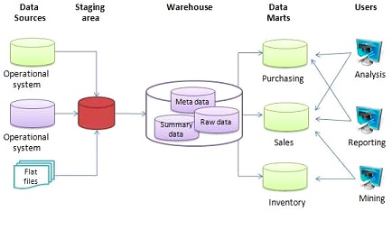
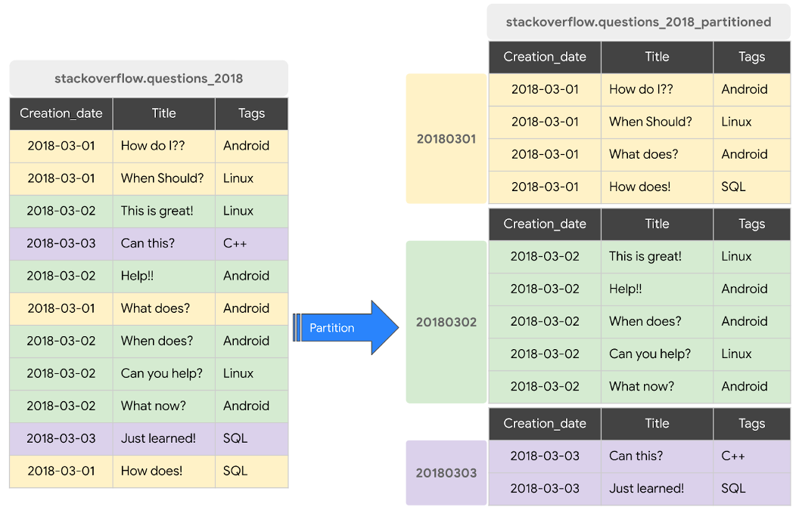
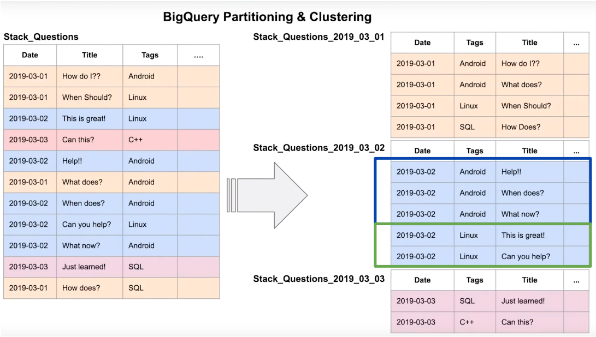
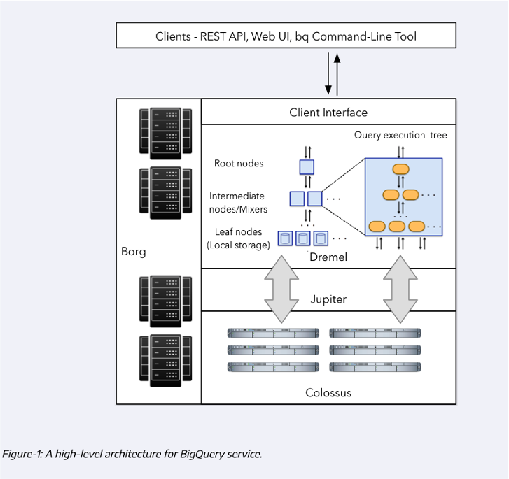
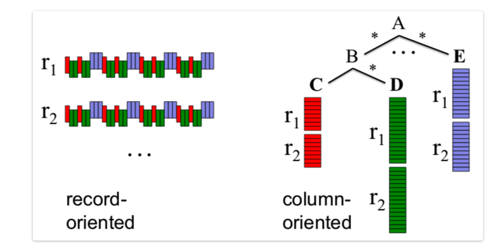
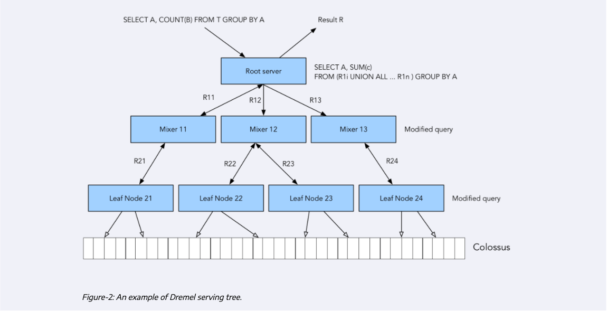

# Table of contents

Slides can be found [here](./DTalks-DataEng-Data%20Warehouse.pptx)

- [DE Zoomcamp 3.1.1 - Data Warehouse and BigQuery](#de-zoomcamp-311---data-warehouse-and-bigquery)
  - [What is a data warehouse](#what-is-a-data-warehouse)
  - [BigQuery](#bigquery)
  - [BigQuery pricing](#bigquery-pricing)
  - [External tables](#external-tables)
  - [Partitions](#partitions)
  - [Clustering](#clustering)
- [DE Zoomcamp 3.1.2 - Partioning and Clustering](#de-zoomcamp-312---partioning-and-clustering)
- [DE Zoomcamp 3.2.1 - BigQuery Best Practices](#de-zoomcamp-321---bigquery-best-practices)
- [DE Zoomcamp 3.2.2 - Internals of Big Query](#de-zoomcamp-322---internals-of-big-query)
  - [BigQuery Architecture](#bigquery-architecture)
  - [Column-oriented vs record-oriened storage](#column-oriented-vs-record-oriented-storage)
  - [Dremel operation](#dremel-operation)

# [DE Zoomcamp 3.1.1 - Data Warehouse and BigQuery](https://www.youtube.com/watch?v=jrHljAoD6nM&list=PL3MmuxUbc_hJed7dXYoJw8DoCuVHhGEQb&index=26)

In Data Science, when we're discussing data processing systems, there are 2 main types: **OLAP** and **OLTP** systems.

- **_OLTP_**: Online Transaction Processing.
- **_OLAP_**: Online Analytical Processing.

An intuitive way of looking at both of these systems is that OLTP systems are "classic databases" whereas OLAP systems are catered for advanced data analytics purposes.

|                     | OLTP                                                                                              | OLAP                                                                              |
| ------------------- | ------------------------------------------------------------------------------------------------- | --------------------------------------------------------------------------------- |
| Purpose             | Control and run essential business operations in real time                                        | Plan, solve problems, support decisions, discover hidden insights                 |
| Data updates        | Short, fast updates initiated by user                                                             | Data periodically refreshed with scheduled, long-running batch jobs               |
| Database design     | Normalized databases for efficiency                                                               | Denormalized databases for analysis                                               |
| Space requirements  | Generally small if historical data is archived                                                    | Generally large due to aggregating large datasets                                 |
| Backup and recovery | Regular backups required to ensure business continuity and meet legal and governance requirements | Lost data can be reloaded from OLTP database as needed in lieu of regular backups |
| Productivity        | Increases productivity of end users                                                               | Increases productivity of business managers, data analysts and executives         |
| Data view           | Lists day-to-day business transactions                                                            | Multi-dimensional view of enterprise data                                         |
| User examples       | Customer-facing personnel, clerks, online shoppers                                                | Knowledge workers such as data analysts, business analysts and executives         |

### What is a Data Warehouse?

A **Data Warehouse** (DW) is an **_OLAP solution_** meant for **_reporting and data analysis_**. Unlike Data Lakes, which follow the `ELT` model, DWs commonly use the `ETL` model.

A DW receives data from different **_data sources_** which is then processed in a **_staging area_** before being ingested to the actual warehouse (a database) and arranged as needed. DWs may then feed data to separate **_Data Marts_**; smaller database systems which end users may use for different purposes.



### BigQuery

BigQuery (BQ) is a Data Warehouse solution offered by Google Cloud Platform.

- BQ is **_serverless_**. There are no servers to manage or database software to install; this is managed by Google and it's transparent to the customers.
- BQ is **_scalable_** and has **_high availability_**. Google takes care of the underlying software and infrastructure.
- BQ has built-in features like Machine Learning, Geospatial Analysis and Business Intelligence among others.
- BQ maximizes flexibility by separating data analysis and storage in different _compute engines_, thus allowing the customers to budget accordingly and reduce costs.

Some alternatives to BigQuery from other cloud providers would be AWS Redshift or Azure Synapse Analytics.

### BigQuery Pricing

BigQuery pricing is divided in 2 main components: processing and storage. There are also additional charges for other operations such as ingestion or extraction. The cost of storage is fixed and at the time of writing is US$0.02 per GB per month; you may check the current storage pricing [in this link](https://cloud.google.com/bigquery/pricing#storage).

Data processing has a [2-tier pricing model](https://cloud.google.com/bigquery/pricing#analysis_pricing_models):

- On demand pricing (default): $5 per TB per month; the first TB of the month is free.
- Flat rate pricing: based on the number of pre-requested _slots_ (virtual CPUs).
  - A minimum of 100 slots is required for the flat-rate pricing which costs $2,000 per month.
  - Queries take up slots. If you're running multiple queries and run out of slots, the additional queries must wait until other queries finish in order to free up the slot. On demand pricing does not have this issue.
  - The flat-rate pricing only makes sense when processing more than 400TB of data per month.

When running queries on BQ, the top-right corner of the window will display an approximation of the size of the data that will be processed by the query. Once the query has run, the actual amount of processed data will appear in the _Query results_ panel in the lower half of the window. This can be useful to quickly calculate the cost of the query.

### External tables

BigQuery supports a few [_external data sources_](https://cloud.google.com/bigquery/external-data-sources): you may query these sources directly from BigQuery even though the data itself isn't stored in BigQuery.

An **_external table_** is a table that acts like a standard BQ table. The table metadata (such as the schema) is stored in BQ storage but the data itself is external.

To create an external table from a CSV or Parquet file stored in a Cloud Storage bucket:

```sql
-- Creating external table referring to gcs path
CREATE OR REPLACE EXTERNAL TABLE `dtc-de-0201.trips_data_all.external_yellow_tripdata`
OPTIONS (
  format = 'parquet',
  uris = ['gs://dtc_data_lake_dtc-de-0201/raw/yellow_trip/yellow_tripdata_2019-*.parquet', 'gs://dtc_data_lake_dtc-de-0201/raw/yellow_trip/yellow_tripdata_2020-*.parquet']
);
```

This query will create an external table based on parquet files. BigQuery will figure out the table schema and the datatypes based on the contents of the files.

Be aware that BigQuery cannot determine processing costs or number of rows of external tables. Therefore, the `Long-term storage size` is 0 and `Table size` is also 0.

```sql
-- Check yellow trip data
SELECT * except(airport_fee) FROM `dtc-de-0201.trips_data_all.external_yellow_tripdata` LIMIT 10
```

You may import an external table into BigQuery as a regular internal table by copying the contents of the external table into a new internal table. For example:

```sql
CREATE OR REPLACE TABLE taxi-rides-ny.nytaxi.yellow_tripdata_non_partitoned AS
SELECT * FROM taxi-rides-ny.nytaxi.external_yellow_tripdata;
```

### Partitions

BigQuery tables can be **_partitioned_** into multiple smaller tables. For example, if we often filter queries based on date, we could partition a table based on date so that we only query a specific sub-table based on the date we're interested in.

[Partition tables](https://cloud.google.com/bigquery/docs/partitioned-tables) are very useful to improve performance and reduce costs, because BigQuery will not process as much data per query.

You may partition a table by:

- **_Time-unit column_**: tables are partitioned based on a `TIMESTAMP`, `DATE`, or `DATETIME` column in the table.
- **_Ingestion time_**: tables are partitioned based on the timestamp when BigQuery ingests the data.
- **_Integer range_**: tables are partitioned based on an integer column.

For Time-unit and Ingestion time columns, the partition may be:

- Daily (the default option).
- Hourly (should have an expire partition strategy).
- Monthly or yearly.

> Note: BigQuery limits the amount of partitions to 4000 per table. If you need more partitions, consider [clustering](#clustering) as well.



Here's an example query for creating a partitioned table:

```sql
-- Create a partitioned table from external table
CREATE OR REPLACE TABLE `dtc-de-0201.trips_data_all.yellow_tripdata_partitioned`
PARTITION BY
  DATE(tpep_pickup_datetime) AS
SELECT * except(airport_fee) FROM `dtc-de-0201.trips_data_all.external_yellow_tripdata`;
```

BigQuery will identify partitioned tables with a specific icon. The _Details_ tab of the table will specify the field which was used for partitioning the table and its datatype.

Querying a partitioned table is identical to querying a non-partitioned table, but the amount of processed data may be drastically different. Here are 2 identical queries to the non-partitioned and partitioned tables we created in the previous queries:

```sql
-- Scanning 1.63 GB of data with non-partitioned table
SELECT DISTINCT(VendorID) FROM `dtc-de-0201.trips_data_all.yellow_tripdata_non_partitioned`
WHERE DATE(tpep_pickup_datetime) BETWEEN '2019-06-01' AND '2019-06-30';
```

- Query to non-partitioned table.
- It will process around 1.63 GB of data

```sql
-- Scanning ~106.37 MB of data with partitioned tabled
SELECT DISTINCT(VendorID) FROM `dtc-de-0201.trips_data_all.yellow_tripdata_partitioned`
WHERE DATE(tpep_pickup_datetime) BETWEEN '2019-06-01' AND '2019-06-30';
```

- Query to partitioned table.
- It will process around 106.37 MB of data.

You may check the amount of rows of each partition in a partitioned table with a query such as this:

```sql
SELECT table_name, partition_id, total_rows
FROM `dtc-de-0201.trips_data_all.INFORMATION_SCHEMA.PARTITIONS`
WHERE table_name = 'yellow_tripdata_partitioned'
ORDER BY total_rows DESC;
```

This is useful to check if there are data imbalances and/or biases in your partitions.

### Clustering

- **_Clustering_** consists of rearranging a table based on the values of its columns so that the table is ordered according to any criteria.
- Clustering can be done based on one or multiple columns up to 4.
- The **_order_** of the columns in which the clustering is specified is important in order to determine the column priority.
- Clustering may improve performance and lower costs on big datasets for certain types of queries, such as queries that use filter clauses and queries that aggregate data.

> Note: tables with less than 1GB don't show significant improvement with partitioning and clustering; doing so in a small table could even lead to increased cost due to the additional metadata reads and maintenance needed for these features.



Clustering columns must be **_top-level_**, **_non-repeated_** columns. The following datatypes are supported:

- `DATE`
- `BOOL`
- `GEOGRAPHY`
- `INT64`
- `NUMERIC`
- `BIGNUMERIC`
- `STRING`
- `TIMESTAMP`
- `DATETIME`

A partitioned table can also be clustered. Here's an example query for creating a partitioned and clustered table:

```sql
-- Creating a partition and cluster table
CREATE OR REPLACE TABLE `dtc-de-0201.trips_data_all.yellow_tripdata_partitioned_clustered`
PARTITION BY DATE(tpep_pickup_datetime)
CLUSTER BY VendorID AS
SELECT * except(airport_fee) FROM `dtc-de-0201.trips_data_all.external_yellow_tripdata`;
```

Just like for partitioned tables, the _Details_ tab for the table will also display the fields by which the table is clustered.

Here are 2 identical queries, one for a partitioned table and the other for a partitioned and clustered table:

```sql
-- Query scans 1.07 GB with partitioned table
SELECT COUNT(*) AS trips
FROM `dtc-de-0201.trips_data_all.yellow_tripdata_partitioned`
WHERE DATE(tpep_pickup_datetime) BETWEEN '2019-06-01' AND '2020-12-31'
AND VendorID=1;
```

- Query to non-clustered, partitioned table.
- This will process about 1.07 GB of data.

```sql
-- Query scans 859.21 MB with partitioned & clustered table
SELECT COUNT(*) AS trips
FROM `dtc-de-0201.trips_data_all.yellow_tripdata_partitioned_clustered`
WHERE DATE(tpep_pickup_datetime) BETWEEN '2019-06-01' AND '2020-12-31'
AND VendorID=1;
```

- Query to partitioned and clustered data.
- This will process about 859.21 MB of data.

# [DE Zoomcamp 3.1.2 - Partioning and Clustering](https://www.youtube.com/watch?v=-CqXf7vhhDs&list=PL3MmuxUbc_hJed7dXYoJw8DoCuVHhGEQb&index=21)

### Partitioning vs Clustering

As mentioned before, you may combine both partitioning and clustering in a table, but there are important differences between both techniques that you need to be aware of in order to decide what to use for your specific scenario:

| Clustering                                                                                                                  | Partitioning                                                                                         |
| --------------------------------------------------------------------------------------------------------------------------- | ---------------------------------------------------------------------------------------------------- |
| Cost benefit unknown. BigQuery cannot estimate the reduction in cost before running a query.                                | Cost known upfront. BigQuery can estimate the amount of data to be processed before running a query. |
| High granularity. Multiple criteria can be used to sort the table.                                                          | Low granularity. Only a single column can be used to partition the table.                            |
| Clusters are "fixed in place".                                                                                              | Partitions can be added, deleted, modified or even moved between storage options.                    |
| Benefits from queries that commonly use filters or aggregation against multiple particular columns.                         | Benefits when you filter or aggregate on a single column.                                            |
| Unlimited amount of clusters; useful when the cardinality of the number of values in a column or group of columns is large. | Limited to 4000 partitions; cannot be used in columns with larger cardinality.                       |

You may choose `clustering over partitioning` when

- Partitioning results in a small amount of data per partition (~ less than 1 GB).
- Partitioning results in a large number of partitions (over 4000).
- Partitioning results in your mutation operations modify the majority of partitions in the table frequently (for example, writing to the table every few minutes and writing to most of the partitions each time rather than just a handful).

BigQuery has `automatic reclustering`. As a data is added to a clustered table

- When newly data is written to a clustered table, it can be written to blocks that contain key ranges that overlap with the key ranges in previously written blocks
- These overlapping weaken the sort property of the table.

To maintain the performance characteristics of a clustered table

- BigQuery performs automatic re-clustering in the background to restore the sort properties of the table.
- For partitioned tables, clustering is maintaned for data within the scope of each partition.

# [DE Zoomcamp 3.2.1 - BigQuery Best Practices](https://www.youtube.com/watch?v=k81mLJVX08w&list=PL3MmuxUbc_hJed7dXYoJw8DoCuVHhGEQb&index=28)

Here's a list of [best practices for BigQuery](https://cloud.google.com/bigquery/docs/best-practices-performance-overview):

- Cost reduction

  - Avoid `SELECT *` . Reducing the amount of columns to display will drastically reduce the amount of processed data and lower costs.
  - Price your queries before running them.
  - Use clustered and/or partitioned tables if possible.
  - Use [streaming inserts](https://cloud.google.com/bigquery/streaming-data-into-bigquery) with caution. They can easily increase cost.
  - [Materialize query results](https://cloud.google.com/bigquery/docs/materialized-views-intro) in different stages.

- Query performance
  - Filter on partitioned columns.
  - [Denormalize data](https://cloud.google.com/blog/topics/developers-practitioners/bigquery-explained-working-joins-nested-repeated-data).
  - Use [nested or repeated columns](https://cloud.google.com/blog/topics/developers-practitioners/bigquery-explained-working-joins-nested-repeated-data).
  - Use external data sources appropiately. Constantly reading data from a bucket may incur in additional costs and has worse performance.
  - Reduce data before using a `JOIN`.
  - Do not treat `WITH` clauses as [prepared statements](https://www.wikiwand.com/en/Prepared_statement).
  - Avoid [oversharding tables](https://cloud.google.com/bigquery/docs/partitioned-tables#dt_partition_shard).
  - Avoid JavaScript user-defined functions.
  - Use [approximate aggregation functions](https://cloud.google.com/bigquery/docs/reference/standard-sql/approximate_aggregate_functions) rather than complete ones such as [HyperLogLog++](https://cloud.google.com/bigquery/docs/reference/standard-sql/hll_functions).
  - Order statements should be the last part of the query.
  - [Optimize join patterns](https://cloud.google.com/bigquery/docs/best-practices-performance-compute#optimize_your_join_patterns).
  - Place the table with the _largest_ number of rows first, followed by the table with the _fewest_ rows, and then place the remaining tables by decreasing size.
    - This is due to how BigQuery works internally: the first table will be distributed evenly and the second table will be broadcasted to all the nodes. Check the [Internals section](#internals) for more details.

# [DE Zoomcamp 3.2.2 - Internals of Big Query](https://www.youtube.com/watch?v=eduHi1inM4s&list=PL3MmuxUbc_hJed7dXYoJw8DoCuVHhGEQb&index=23)

_[Additional source](https://cloud.google.com/blog/products/data-analytics/new-blog-series-bigquery-explained-overview)_

While it's not strictly necessary to understand how the internals of BigQuery work, it can be useful to know in order to understand the reasoning behind the [best practices](#de-zoomcamp-321---bigquery-best-practices).

### BigQuery Architecture

BigQuery is built on 4 infrastructure technologies.

- **_Dremel_**: the _compute_ part of BigQuery. It executes the SQL queries.
  - Dremel turns SQL queries into _execution trees_. The leaves of these trees are called _slots_ and the branches are called _mixers_.
  - The _slots_ are in charge of reading data from storage and perform calculations.
  - The _mixers_ perform aggregation.
  - Dremel dinamically apportions slots to queries as needed, while maintaining fairness for concurrent queries from multiple users.
- **_Colossus_**: Google's global storage system.
  - BigQuery leverages a _columnar storage format_ and compression algorithms to store data.
  - Colossus is optimized for reading large amounts of structured data.
  - Colossus also handles replication, recovery and distributed management.
- **_Jupiter_**: the network that connects Dremel and Colossus.
  - Jupiter is an in-house network technology created by Google which is used for interconnecting its datacenters.
- **_Borg_**: an orchestration solution that handles everything.
  - Borg is a precursor of Kubernetes.



### Column-oriented vs record-oriented storage

Traditional methods for tabular data storage are **_record-oriented_** (also known as _row-oriented_). Data is read sequentially row by row and then the columns are accessed per row. An example of this is a CSV file: each new line in the file is a record and all the info for that specific record is contained within that line.

BigQuery uses a **_columnar storage format_**. Data is stored according to the columns of the table rather than the rows. This is beneficial when dealing with massive amounts of data because it allows us to discard right away the columns we're not interested in when performing queries, thus reducing the amount of processed data.



### Dremel operation

When performing queries, Dremel modifies them in order to create an _execution tree_: parts of the query are assigned to different mixers which in turn assign even smaller parts to different slots which will access Colossus and retrieve the data.

The columnar storage format is perfect for this workflow as it allows very fast data retrieval from colossus by multiple workers, which then perform any needed computation on the retrieved datapoints and return them to the mixers, which will perform any necessary aggregation before returning that data to the root server, which will compose the final output of the query.


