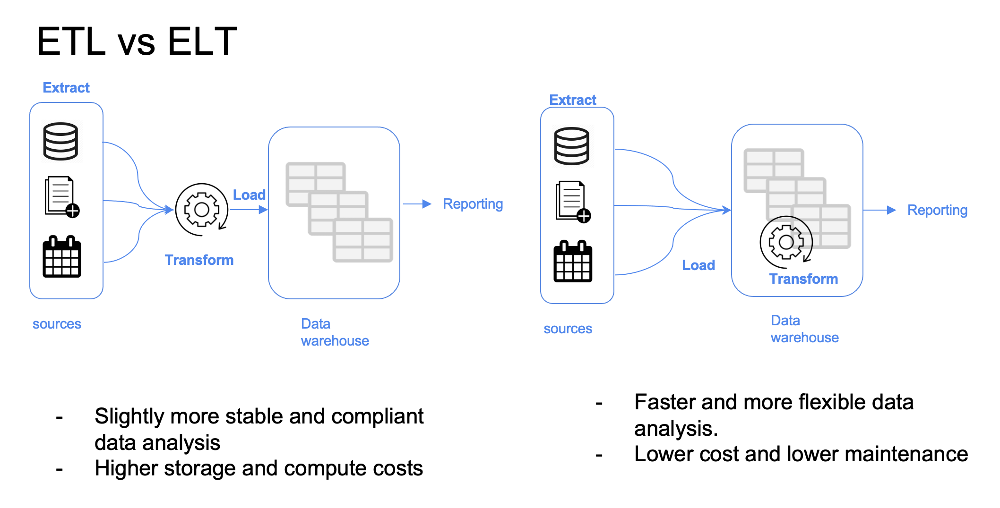
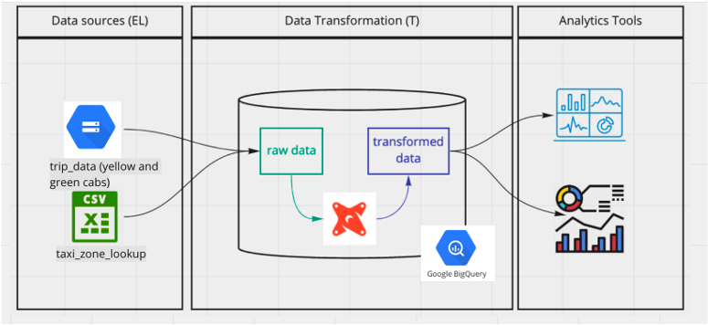

# Goal

Transforming the data loaded in DWH to Analytical Views developing a dbt project.

Slides can be found [here](./Data%20engineering%20Zoomcap%20week%204_%20Analytics%20Engineers.pptx)

# Prerequisites

We will build a project using dbt and a running data warehouse. By this stage of the course you should have already:

- A running warehouse (BigQuery or postgres)
- A set of running pipelines ingesting the project dataset (week 3 completed): [Datasets list](https://github.com/DataTalksClub/nyc-tlc-data/)
- Yellow taxi data - Years 2019 and 2020
- Green taxi data - Years 2019 and 2020
- fhv data - Year 2019.

_Note: If you recieve an error stating "Permission denied while globbing file pattern." when attemting to run fact_trips.sql [this video](https://www.youtube.com/watch?v=kL3ZVNL9Y4A) may be helpful in resolving the issue._

# Table of contents

- [DE Zoomcamp 4.1.1 - Analytics Engineering Basics](#de-zoomcamp-411---analytics-engineering-basics)
  - [What is analytics engineering?](#what-is-analytics-engineering)
  - [ETL vs ELT](#etl-vs-elt)
  - [Data modeling concepts (fact and dim tables)](#data-modeling-concepts-fact-and-dim-tables)
- [DE Zoomcamp 4.1.2 - What is dbt](#de-zoomcamp-412---what-is-dbt)
- [DE Zoomcamp 4.2.1 - Start Your dbt Project: BigQuery and dbt Cloud (Alternative A)](#de-zoomcamp-421---start-your-dbt-project-bigquery-and-dbt-cloud-alternative-a)
- [DE Zoomcamp 4.2.2 - Start Your dbt Project: Postgres and dbt Core Locally (Alternative B)](#de-zoomcamp-422---start-your-dbt-project-postgres-and-dbt-core-locally-alternative-b)
- [DE Zoomcamp 4.3.1 - Build the First dbt Models](#de-zoomcamp-431---build-the-first-dbt-models)
  - [Anatomy of a dbt model: written code vs compiled Sources](#anatomy-of-a-dbt-model-written-code-vs-compiled-sources)
  - [The FROM clause](#the-from-clause)
  - [Define a source and develop the first model](#define-a-source-and-develop-the-first-model)
  - [Macros](#macros)
  - [Packages](#packages)
  - [Variables](#variables)
  - [Creating and using dbt seed](#creating-and-using-dbt-seed)
- [DE Zoomcamp 4.3.2 - Testing and Documenting the Project](#de-zoomcamp-432---testing-and-documenting-the-project)
  - [Testing](#testing)
  - [Documentation](#documentation)
  - [Practice](#practice)

# [DE Zoomcamp 4.1.1 - Analytics Engineering Basics](https://www.youtube.com/watch?v=uF76d5EmdtU&list=PL3MmuxUbc_hJed7dXYoJw8DoCuVHhGEQb&index=35)

### What is analytics engineering?

As the _data domain_ has developed over time, new tools have been introduced that have changed the dynamics of working with data:

1. Massively parallel processing (MPP) databases
   - Lower the cost of storage
   - BigQuery, Snowflake, Redshift...
2. Data-pipelines-as-a-service
   - Simplify the ETL process
   - Fivetran, Stitch...
3. SQL-first / Version control systems
   - Looker...
4. Self service analytics
   - Mode...
5. Data governance

The introduction of all of these tools changed the way the data teams work as well as the way that the stakeholders consume the data, creating a gap in the roles of the data team. Traditionally:

- The **_data engineer_** prepares and maintains the infrastructure the data team needs.
- The **_data analyst_** uses data to answer questions and solve problems (they are in charge of _today_).
- The **_data scientist_** predicts the future based on past patterns and covers the what-ifs rather than the day-to-day (they are in charge of _tomorrow_).

However, with the introduction of these tools, both data scientists and analysts find themselves writing more code even though they're not software engineers and writing code isn't their top priority. Data engineers are good software engineers but they don't have the training in how the data is going to be used by the business users.

The **_analytics engineer_** is the role that tries to fill the gap: it introduces the good software engineering practices to the efforts of data analysts and data scientists. The analytics engineer may be exposed to the following tools:

1. Data Loading (Stitch...)
2. Data Storing (Data Warehouses)
3. Data Modeling (dbt, Dataform...)
4. Data Presentation (BI tools like Looker, Mode, Tableau...)

This lesson focuses on the last 2 parts: Data Modeling and Data Presentation.

### ETL vs ELT



### Data modeling concepts (fact and dim tables)

[Ralph Kimball's Dimensional Modeling](<https://www.wikiwand.com/en/Dimensional_modeling#:~:text=Dimensional%20modeling%20(DM)%20is%20part,use%20in%20data%20warehouse%20design.>) is an approach to Data Warehouse design which focuses on 2 main points:

- Deliver data which is understandable to the business users.
- Deliver fast query performance.

Other goals such as reducing redundant data (prioritized by other approaches such as [3NF](<https://www.wikiwand.com/en/Third_normal_form#:~:text=Third%20normal%20form%20(3NF)%20is,integrity%2C%20and%20simplify%20data%20management.>) by [Bill Inmon](https://www.wikiwand.com/en/Bill_Inmon)) are secondary to these goals. Dimensional Modeling also differs from other approaches to Data Warehouse design such as [Data Vaults](https://www.wikiwand.com/en/Data_vault_modeling).

Dimensional Modeling is based around 2 important concepts:

- **_Fact Table_**:
  - _Facts_ = _Measures_
  - Typically numeric values which can be aggregated, such as measurements or metrics.
    - Examples: sales, orders, etc.
  - Corresponds to a [_business process_ ](https://www.wikiwand.com/en/Business_process).
  - Can be thought of as _"verbs"_.
- **_Dimension Table_**:
  - _Dimension_ = _Context_
  - Groups of hierarchies and descriptors that define the facts.
    - Example: customer, product, etc.
  - Corresponds to a _business entity_.
  - Can be thought of as _"nouns"_.
- Dimensional Modeling is built on a [**_star schema_**](https://www.wikiwand.com/en/Star_schema) with fact tables surrounded by dimension tables.

A good way to understand the _architecture_ of Dimensional Modeling is by drawing an analogy between dimensional modeling and a restaurant:

- Stage Area:
  - Contains the raw data.
  - Not meant to be exposed to everyone.
  - Similar to the food storage area in a restaurant.
- Processing area:
  - From raw data to data models.
  - Focuses in efficiency and ensuring standards.
  - Similar to the kitchen in a restaurant.
- Presentation area:
  - Final presentation of the data.
  - Exposure to business stakeholder.
  - Similar to the dining room in a restaurant.

# [DE Zoomcamp 4.1.2 - What is dbt](https://www.youtube.com/watch?v=4eCouvVOJUw&list=PL3MmuxUbc_hJed7dXYoJw8DoCuVHhGEQb&index=36)

**`dbt`** stands for **`data build tool`**. It's a `transformation` tool: it allows us to transform process `raw` data in our Data Warehouse to `transformed` data which can be later used by Business Intelligence tools and any other data consumers.

dbt also allows us to introduce good software engineering practices by defining a `deployment workflow`:

1. Develop models.
2. Test and document models.
3. Deploy models with `version control` and `CI/CD`.

### How does dbt work?

dbt works by defining a **`modeling layer`** that sits on top of our Data Warehouse. The modeling layer will turn `tables` into **`models`** which we will then transform into `derived models`, which can be then stored into the Data Warehouse for persistence.

A **`model`** is a .sql file with a `SELECT` statement; no DDL (Data Definition Language) or DML (Data Manipulation Language) is used. dbt will compile the file and run it in our Data Warehouse.

### How to use dbt?

dbt has 2 main components: `dbt Core` and `dbt Cloud`:

- **`dbt Core`**: open-source project that allows the data transformation.
  - Builds and runs a dbt project (.sql and .yaml files).
  - Includes SQL compilation logic, macros and database adapters.
  - Includes a CLI interface to run dbt commands locally.
  - Open-source and free to use.
- **`dbt Cloud`**: SaaS application to develop and manage dbt projects.
  - Web-based IDE to develop, run and test a dbt project.
  - Jobs orchestration.
  - Logging and alerting.
  - Intregrated documentation.
  - Free for individuals (one developer seat).

For integration with BigQuery we will use the dbt Cloud IDE, so a local installation of dbt core isn't required. For developing locally rather than using the Cloud IDE, dbt Core is required. Using dbt with a local Postgres database can be done with dbt Core, which can be installed locally and connected to Postgres and run models through the CLI.



# [DE Zoomcamp 4.2.1 - Start Your dbt Project: BigQuery and dbt Cloud (Alternative A)](https://www.youtube.com/watch?v=iMxh6s_wL4Q&list=PL3MmuxUbc_hJed7dXYoJw8DoCuVHhGEQb&index=37)

In order to use dbt Cloud you will need to create a user account. Got to the [dbt homepage](https://www.getdbt.com/) and sign up.

During the sign up process you will be asked to create a starter project and connect to a database. We will connect dbt to BigQuery using [BigQuery OAuth](https://docs.getdbt.com/docs/dbt-cloud/cloud-configuring-dbt-cloud/cloud-setting-up-bigquery-oauth). More detailed instructions on how to generate the credentials and connect both services are available [in dbt_cloud_setup.md](./dbt_cloud_setup.md). When asked, connnect the project to your `development` dataset.

Make sure that you set up a GitHub repo for your project. In `Account settings` > `Projects` you can select your project and change its settings, such as `Name` or `dbt Project Subdirectoy`, which can be convenient if your repo is previously populated and would like to keep the dbt project in a single subfolder.

**Go to BigQuery and create schema [`dbt_hpham`](./images/development-credential.png).**

- This schema is where we create models while we are developing them. Quite similar to a sandbox.

**Go to BigQuery and create schema `production`.**

- This schema is used for running the models after deployment.

In the IDE windows, press the green `Initilize` button to create the project files. Inside `dbt_project.yml`, change the project name both in the `name` field as well as right below the `models:` block. You may comment or delete the `example` block at the end.

# [DE Zoomcamp 4.2.2 - Start Your dbt Project: Postgres and dbt Core Locally (Alternative B)](https://www.youtube.com/watch?v=1HmL63e-vRs&list=PL3MmuxUbc_hJed7dXYoJw8DoCuVHhGEQb&index=37)

As an alternative to the cloud, that require to have a cloud database, you will be able to run the project installing dbt locally. You can follow the [official dbt documentation](https://docs.getdbt.com/docs/core/installation-overview) or use a docker image from [oficial dbt repo](https://github.com/dbt-labs/dbt-core). You will need to install the latest version (1.0) with the postgres adapter (dbt-postgres). After local installation you will have to set up the connection to PG in the `profiles.yml`, you can find the templates [here](https://docs.getdbt.com/docs/core/connect-data-platform/postgres-setup).

# [DE Zoomcamp 4.3.1 - Build the First dbt Models](https://www.youtube.com/watch?v=UVI30Vxzd6c&list=PL3MmuxUbc_hJed7dXYoJw8DoCuVHhGEQb&index=39)

### Anatomy of a dbt model: written code vs compiled Sources

dbt models are mostly written in SQL (remember that a dbt model is essentially a `SELECT` query) but they also make use of the [Jinja templating language](https://jinja.palletsprojects.com/en/3.0.x/) for templates.

Here's an example dbt model:

```sql
{{
    config(materialized='table')
}}

SELECT *
FROM staging.source_table
WHERE record_state = 'ACTIVE'
```

- In the Jinja statement defined within the `{{ }}` block we call the [`config()` function](https://docs.getdbt.com/reference/dbt-jinja-functions/config). More info about Jinja macros for dbt [in this link](https://docs.getdbt.com/docs/building-a-dbt-project/jinja-macros).
- We commonly use the `config()` function at the beginning of a model to define a **_materialization strategy_**: a strategy for persisting dbt models in a warehouse.
  - The `table` strategy means that the model will be rebuilt as a table on each run.
  - We could use a `view` strategy instead, which would rebuild the model on each run as a SQL view.
  - The `incremental` strategy is essentially a `table` strategy but it allows us to add or update records incrementally rather than rebuilding the complete table on each run.
  - The `ephemeral` strategy creates a _[Common Table Expression](https://www.essentialsql.com/introduction-common-table-expressions-ctes/)_ (CTE).
  - You can learn more about materialization strategies with dbt [in this link](https://docs.getdbt.com/docs/building-a-dbt-project/building-models/materializations). Besides the 4 common `table`, `view`, `incremental` and `ephemeral` strategies, custom strategies can be defined for advanced cases.

dbt will compile above code into the following SQL query:

```sql
CREATE TABLE my_schema.my_model AS (
    SELECT *
    FROM staging.source_table
    WHERE record_state = 'ACTIVE'
)
```

After the code is compiled, dbt will run the compiled code in the Data Warehouse.

Additional model properties are stored in YAML files. Traditionally, these files were named `schema.yml` but later versions of dbt do not enforce this as it could lead to confusion.

### The FROM clause

The `FROM` clause within a `SELECT` statement defines the _sources_ of the data to be used.

The following sources are available to dbt models:

- **_Sources_**: The data loaded within our Data Warehouse.

  - We can access this data with the `source()` function.
  - The `sources` key in our YAML file contains the details of the databases that the `source()` function can access and translate into proper SQL-valid names.
    - Additionally, we can define `source freshness` to each source so that we can check whether a source is "fresh" or "stale", which can be useful to check whether our data pipelines are working properly.
  - More info about sources [in this link](https://docs.getdbt.com/docs/building-a-dbt-project/using-sources).

  Here's an example of how you would declare a source in a `.yml` file:

  ```yaml
  sources:
    - name: staging
      database: production
      schema: trips_data_all

      loaded_at_field: record_loaded_at
      tables:
        - name: green_tripdata
        - name: yellow_tripdata
          freshness:
            error_after: { count: 6, period: hour }
  ```

  And here's how you would reference a source in a `FROM` clause:

  ```sql
  FROM {{ source('staging','yellow_tripdata') }}
  ```

  - The first argument of the `source()` function is the source name, and the second is the table name.

- **_Seeds_**: CSV files which can be stored in our repo under the `seeds` folder.

  - The repo gives us version controlling along with all of its benefits.
  - Seeds are best suited to static data which changes infrequently.
  - Seed usage:
    1. Add a CSV file to your `seeds` folder.
    2. Run the [`dbt seed -s file_name` command](https://docs.getdbt.com/reference/commands/seed) to create a table in our Data Warehouse.
       - If you update the content of a seed, running `dbt seed` will append the updated values to the table rather than substituing them. Running `dbt seed --full-refresh` instead will drop the old table and create a new one.
    3. Refer to the seed in your model with the `ref()` function.
  - More info about seeds [in this link](https://docs.getdbt.com/docs/building-a-dbt-project/seeds).

  In the case of seeds, assuming you've got a `taxi_zone_lookup.csv` file in your `seeds` folder which contains `locationid`, `borough`, `zone` and `service_zone`:

  ```sql
  SELECT
      locationid,
      borough,
      zone,
      replace(service_zone, 'Boro', 'Green') as service_zone
  FROM {{ ref('taxi_zone_lookup') }}
  ```

Example of `ref()`. The `ref()` function references underlying tables and views in the Data Warehouse. When compiled, it will automatically build the dependencies and resolve the correct schema fo us. So, if BigQuery contains a schema/dataset called `dbt_dev` inside the `my_project` database which we're using for development and it contains a table called `stg_green_tripdata`, then the following code...

```sql
WITH green_data AS (
    SELECT *,
        'Green' AS service_type
    FROM {{ ref('stg_green_tripdata') }}
),
```

...will compile to this:

```sql
WITH green_data AS (
    SELECT *,
        'Green' AS service_type
    FROM "my_project"."dbt_dev"."stg_green_tripdata"
),
```

- The `ref()` function translates our references table into the full reference, using the `database.schema.table` structure.
- If we were to run this code in our production environment, dbt would automatically resolve the reference to make ir point to our production schema.

### Define a source and develop the first model

Go to dbt IDE -> Initialize dbt project into folder `taxi_rides_ny`. Navigate to project settings in dbt Cloud and set `DBT PROJECT SUBDIRECTORY` under `week_4_analytics_engineering/taxi_rides_ny`.

1.  Open file `dbt_project.yml`, change and

    ```yaml
    name: "taxi_rides_ny"
    ---
    models:
      taxi_rides_ny:
    ```

1.  Under the `models` folder, create 2 new folders:

    - `staging`: will have the raw models.

      - Create file `stg_green_tripdata.sql`. Defining the 2 tables for yellow and green taxi data as our sources. This query will create a view in the staging dataset/schema in our database. We make use of the `source()` function to access the green taxi data table, which is defined inside the `schema.yml` file.

      ```sql
       {{ config(materialized='view') }}

       select * from {{ source('staging', 'green_tripdata')}}
       limit 1000
      ```

      - Create file `schema.yml`. Define sources in the schema.yml model properties file.

      ```yaml
      version: 2

      sources:
        - name: staging
          database: dtc-de-0201
          schema: trips_data_all

          tables:
            - name: yellow_tripdata
            - name: green_tripdata
      ```

    - `core`: will have the models that we will expose at the end to the BI tool, stakeholders, etc.

The advantage of having the properties in a separate file is that we can easily modify the `schema.yml` file to change the database details and write to different databases without having to modify our `sgt_green_tripdata.sql` file.

Run the model with the dbt run command, either locally or from dbt Cloud.

- Run specific model.
  > dbt run -m stg_green_tripdata \
  > or \
  > dbt run --select stg_green_tripdata
- Run all the models.
  > dbt run

### Macros

**_Macros_** are pieces of code in Jinja that can be reused, similar to functions in other languages.

dbt already includes a series of macros like `config()`, `source()` and `ref()`, but custom macros can also be defined.

Macros allow us to add features to SQL that aren't otherwise available, such as:

- Use control structures such as `if` statements or `for` loops in SQL.
- Use environment variables in our dbt project for production.
- Operate on the results of one query to generate another query.
- Abstract snippets of SQL into reusable macros.

Macros are defined in separate `.sql` files which are typically stored in a `macros` directory.

There are 3 kinds of Jinja _delimiters_:

- `` for **_statements_** (control blocks, macro definitions)
- `{{ ... }}` for **_expressions_** (literals, math, comparisons, logic, macro calls...)
- `{# ... #}` for comments.

Create a file name `get_payment_type_description.sql` inside `macros` folder. Here's a macro definition example:

```sql
{# This macro returns the description of the payment_type #}



  case {{ payment_type }}
    when 1 then 'Credit card'
    when 2 then 'Cash'
    when 3 then 'No charge'
    when 4 then 'Dispute'
    when 5 then 'Unknown'
    when 6 then 'Voided trip'
  end


```

- The `macro` keyword states that the line is a macro definition. It includes the name of the macro as well as the parameters.
- The code of the macro itself goes between 2 statement delimiters. The second statement delimiter contains an `endmacro` keyword.
- In the code, we can access the macro parameters using expression delimiters.
- The macro returns the **_code_** we've defined rather than a specific value.

Then modify the `stg_green_tripdata.sql` and run dbt again. Here's how we use the macro:

```sql
select
  -- ...
  {{ get_payment_type_description('payment-type') }} as payment_type_description,
  congestion_surcharge::double precision
from {{ source('staging','green_tripdata') }}
where vendorid is not null
```

- We pass a `payment-type` variable which may be an integer from 1 to 6.

The complied sql code is under the `target > complied > taxi_rides_ny > models > staging` folder. And this is what it would compile to:

```sql
select
  case payment_type
    when 1 then 'Credit card'
    when 2 then 'Cash'
    when 3 then 'No charge'
    when 4 then 'Dispute'
    when 5 then 'Unknown'
    when 6 then 'Voided trip'
  end as payment_type_description,
  congestion_surcharge::double precision
from {{ source('staging','green_tripdata') }}
where vendorid is not null
```

- The macro is replaced by the code contained within the macro definition as well as any variables that we may have passed to the macro parameters.

### Packages

Macros can be exported to **_packages_**, similarly to how classes and functions can be exported to libraries in other languages. Packages contain standalone dbt projects with models and macros that tackle a specific problem area.

When you add a package to your project, the package's models and macros become part of your own project. A list of useful packages can be found in the [dbt package hub](https://hub.getdbt.com/).

To use a package, you must first create a `packages.yml` file in the root of your work directory. Here's an example:

```yaml
packages:
  - package: dbt-labs/dbt_utils
    version: 0.8.0
```

After declaring your packages, you need to install them by running the command either locally or on dbt Cloud. After install the package, under folder `dtb_packages`, there will be folder `dtb_utils`.

> dbt deps

You may access macros inside a package in a similar way to how Python access class methods:

Modify the model `stg_green_tripdata.sql` again.

```sql
select
  {{ dbt_utils.surrogate_key(['vendorid', 'lpep_pickup_datetime']) }} as tripid,
  cast(vendorid as integer) as vendorid,
  -- ...
```

- The `surrogate_key()` macro generates a hashed [surrogate key](https://www.geeksforgeeks.org/surrogate-key-in-dbms/) with the specified fields in the arguments.

### Variables

Like most other programming languages, **_variables_** can be defined and used across our project.

Variables can be defined in 2 different ways:

- 1st: Under the `vars` keyword inside `dbt_project.yml`.
  ```yaml
  vars:
    payment_type_values: [1, 2, 3, 4, 5, 6]
  ```
- 2nd: On command line, add arguments when building or running your project.
  ```sh
  dbt build --m <your-model.sql> --vars '{"is_test_run": false}'
  ```

Variables can be used with the `{{ var('...') }}` macro. For example, modify the model `stg_green_tripdata.sql` again:

```sql
-- ...
where vendorid is not null
-- dbt build -m <model.sql> --vars '{"is_test_run": false}'

  limit 100

```

- In this example, the default value for `is_test_run` is `true`; in the absence of a variable definition either on the `dbt_project.yml` file or when running the project, then `is_test_run` would be `true`.
- Since we passed the value `false` when runnning `dbt build`, then the `if` statement would evaluate to `false` and the code within would not run.

`dbt_project.yml` file:

```yaml
vars:
  is_test_run: true
```

### Create the same `stg_yellow_tripdata.sql` and run the command `dbt run` to execute both models.

### Creating and using `dbt seed`

- `dbt seed` is meant to use with small files that the data is not changed often.
- Create `taxi_zone_lookup.csv` file under `seeds` folder and copy paste the data into this file.
- Run this command in order to create the table in the BigQuery database with the data type will be automatically assigned.
  > dbt seed
- If you want to specific the data type, we can define it in `dbt_project.yml`

  ```yaml
  seeds:
    taxi_rides_ny:
      taxi_zone_lookup:
        +column_types:
          locationid: numeric
  ```

- If the table is already existed and `dbt seed` command is run again, then the data will be `appended` into the table. In order to drop & create the whole table again, run:

  > dbt seed --full-refresh

- Create `dim_zones.sql` file under `models/core` folder.

  The models we've created in the staging area are for normalizing the fields of both green and yellow taxis. With normalized field names we can now join the 2 together in more complex ways.

  The `ref()` macro is used for referencing any undedrlying tables and views that we've created, so we can reference seeds as well as models using this macro:

  ```sql
  {{ config(materialized='table') }}

  select
      locationid,
      borough,
      zone,
      replace(service_zone, 'Boro', 'Green') as service_zone
  from {{ ref('taxi_zone_lookup') }}
  ```

  This model references the `taxi_zone_lookup` table created from the taxi zone lookup CSV seed.

- Create file `fact_trips.sql` under `models/core` folder.
  ```sql
  with green_data as (
    select *,
        'Green' as service_type
    from {{ ref('stg_green_tripdata') }}
  ),
  ```
  This snippet references the sgt_green_tripdata model that we've created before. Since a model outputs a table/view, we can use it in the FROM clause of any query.

To run all models without seed, run:

> dbt run

> Note: running `dbt run` will run all models but NOT the seeds. The `dbt build` can be used instead to run all seeds and models as well as tests, which we will cover later. Additionally, running `dbt run --select my_model` will only run the model itself, but running `dbt run --select +my_model` will run the model as well as all of its dependencies.

# [DE Zoomcamp 4.3.2 - Testing and Documenting the Project](https://www.youtube.com/watch?v=UishFmq1hLM&list=PL3MmuxUbc_hJed7dXYoJw8DoCuVHhGEQb&index=29)

Testing and documenting are not required steps to successfully run models, but they are expected in any professional setting.

### Testing

Tests in dbt are **_assumptions_** that we make about our data.

In dbt, tests are essentially a `SELECT` query that will return the amount of records that fail because they do not follow the assumption defined by the test.

Tests are defined on a column in the model YAML files (like the `schema.yml` file we defined before). dbt provides a few predefined tests to check column values but custom tests can also be created as queries. Here's an example test:

```yaml
models:
  - name: stg_yellow_tripdata
    description: Trips made by New York City's iconic yellow taxis.
    columns:
      - name: tripid
      description: Primary key for this table, generated with a concatenation of vendorid+pickup_datetime
        tests:
          - unique:
              severity: warn
          - not_null:
              severity: warn
```

- The tests are defined for a column in a specific table for a specific model.
- There are 2 tests in this YAML file: `unique` and `not_null`. Both are predefined by dbt.
- `unique` checks whether all the values in the `tripid` column are unique.
- `not_null` checks whether all the values in the `tripid` column are not null.
- Both tests will return a warning in the command line interface if they detect an error.

Here's wwhat the `not_null` will compile to in SQL query form:

```sql
select *
from "my_project"."dbt_dev"."stg_yellow_tripdata"
where tripid is null
```

Run tests command.

> dbt test

### Documentation

dbt also provides a way to generate documentation for your dbt project and render it as a website.

You may have noticed in the previous code block that a `description:` field can be added to the YAML field. dbt will make use of these fields to gather info.

The dbt generated docs will include the following:

- Information about the project:
  - Model code (both from the .sql files and compiled code)
  - Model dependencies
  - Sources
  - Auto generated DAGs from the `ref()` and `source()` macros
  - Descriptions from the .yml files and tests
- Information about the Data Warehouse (`information_schema`):
  - Column names and data types
  - Table stats like size and rows

dbt docs can be generated on the cloud or locally with `dbt docs generate`, and can be hosted in dbt Cloud as well or on any other webserver with `dbt docs serve`.

### Practice

Create a file `dm_monthly_zone_revenue.sql` under `models/core` folder -> Add sql script.

Modify the `schema.yml` under `models/staging` folder. Add the section `models` into the schema file, this section is not mandatory but it is encouraged to do.

```yaml
models:
  - name: stg_green_tripdata
    description: ...
    columns:
      - name: tripid
        description: ...
        tests:
          - unique:
              severity: warn
          - not_null:
              serviry: warn
      ...
```

Once this test is running in the terminal, if it fails, should dbt still keep running everthing else or it stop entirely? A `warn` means that at the end it's going to show in the terminal the warning but it still keep running everthing.

Modify the file `dbt_project.yml` to add the variable that watns to use.

```yaml
vars:
  is_test_run: true
  payment_type_values: [1, 2, 3, 4, 5, 6]
```

Then run:

> dbt test

There will be a warning shows that the `tripid` column is not unique. We have to go to both `stg_green_tripdata` & `stg_yellow_tripdata` to modify the the script.

```sql
{{ config(materialized = 'view') }}
with tripdata as
(
  select *,
    row_number() over(partition by vendorid, lpep_pickup_datetime) as rn
  from {{ source('staging', 'green_tripdata') }}
  where vendorid is not null
)

-- ...
from tripdata
where rn = 1
--- ...
```

Then run:

> dbt build --vars '{"is_test_run": false}' \
> or \
> dbt run --vars '{"is_test_run": false}'

> dbt test

If all the tests are passed -> Good.

Then create more `schema.yml` file for documentation under folder `models/core`, `macros`, `seeds`.
