# Table of Contents

- [How to setup dbt cloud with bigquery](#how-to-setup-dbt-cloud-with-bigquery)
  - [Create a BigQuery service account](#create-a-bigquery-service-account)
  - [Create a dbt cloud project](#create-a-dbt-cloud-project)
  - [Add GitHub repository](#add-github-repository)
  - [Review your project settings](#review-your-project-settings)
  - [(Optional) Link to your github account](#optional-link-to-your-github-account)

# How to setup dbt cloud with bigquery

[Official documentation](https://docs.getdbt.com/tutorial/setting-up)

## Create a BigQuery service account

In order to connect we need the service account JSON file generated from bigquery:

1. Open the [BigQuery credential wizard](https://console.cloud.google.com/apis/credentials/wizard) to create a service account in your taxi project

<table><tr>
<td> 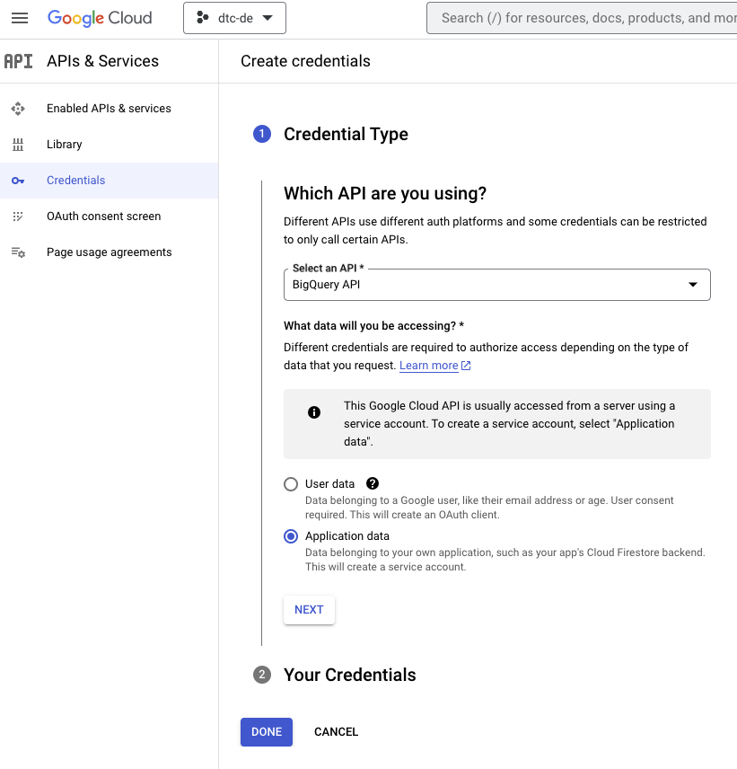 </td>
<td> 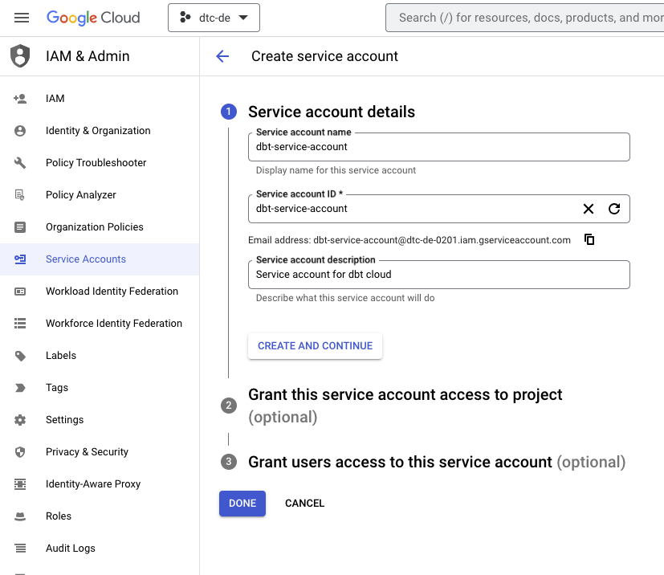 </td>
</tr></table>

2. You can either grant the specific roles the account will need or simply use bq admin, as you'll be the sole user of both accounts and data.

_Note: if you decide to use specific roles instead of BQ Admin, some users reported that they needed to add also viewer role to avoid encountering denied access errors_

<table><tr>
<td> 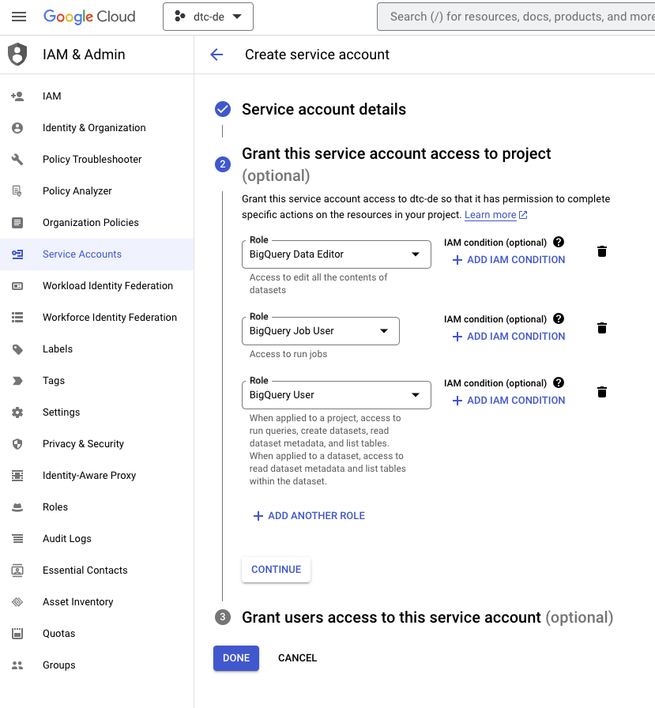 </td>
<td> 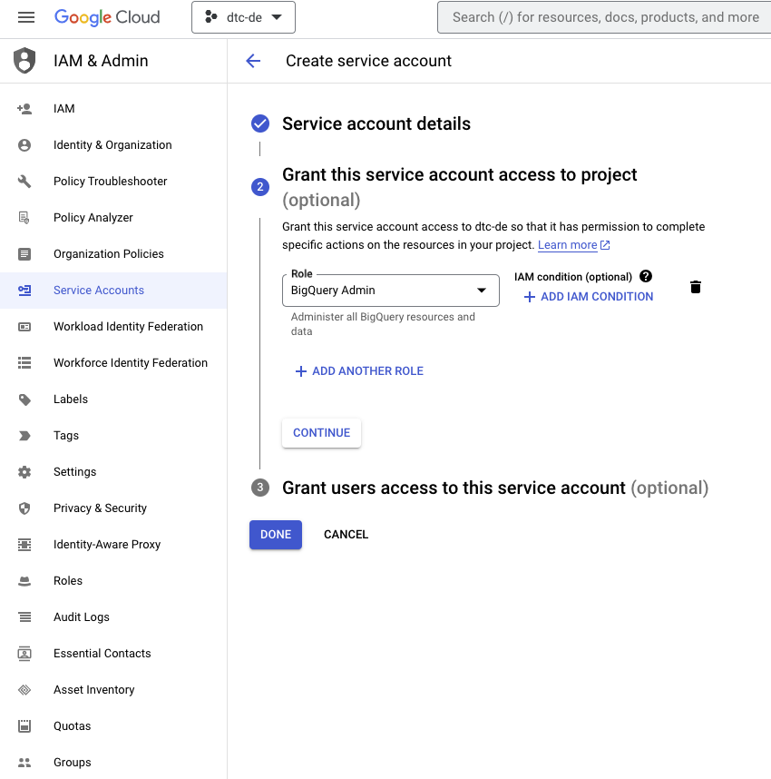 </td>
</tr></table>

3. Now that the service account has been created we need to add and download a JSON key, go to the keys section, select `ADD KEY` > `Create new key`. Select key type `JSON` and once you click on create it will get inmediately downloaded for you to use.

<table><tr>
<td> 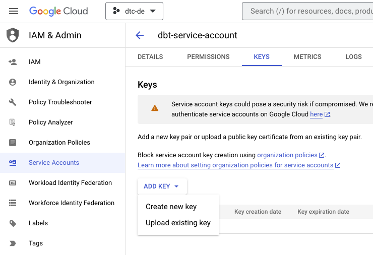 </td>
</tr></table>

## Create a dbt cloud project

1. Create a dbt cloud account from [their website](https://www.getdbt.com/pricing/) (free for solo developers)
2. Once you have logged in into dbt cloud you will be prompt to create a new project

You are going to need:

- access to your data warehouse (bigquery - set up in weeks 2 and 3)
- admin access to your repo, where you will have the dbt project.

_Note: For the sake of showing the creation of a project from scratch I've created a new empty repository just for this week project._

3. Name your project.
4. `Choose a connection`: Choose Bigquery as your data warehouse.
5. `Configure your environment`: Upload the key you downloaded from BQ on the `Upload a Service Account JSON file` option. This will fill out most fields related to the production credentials. Scroll down to the end of the page and set up your development credentials.

_Note: The dataset you'll see under the development credentials is the one you'll use to run and build your models during development. Since BigQuery's default location may not match the one you sued for your source data, it's recommended to create this schema manually to avoid multiregion errors._

<table><tr>
<td> 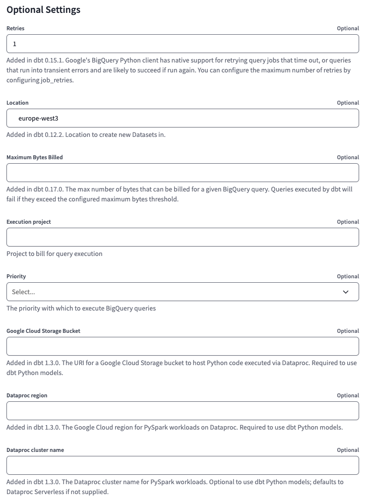 </td>
<td> 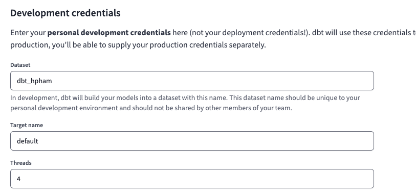 </td>
</tr></table>

6. Click on `Test Connection` and after that you can continue with the setup.

## Add GitHub repository

_Note:_ This step could be skipped by using a managed repository if you don't have your own GitHub repo for the course.

1. Select git clone and paste the SSH key from your repo.

 <table><tr>
<td> 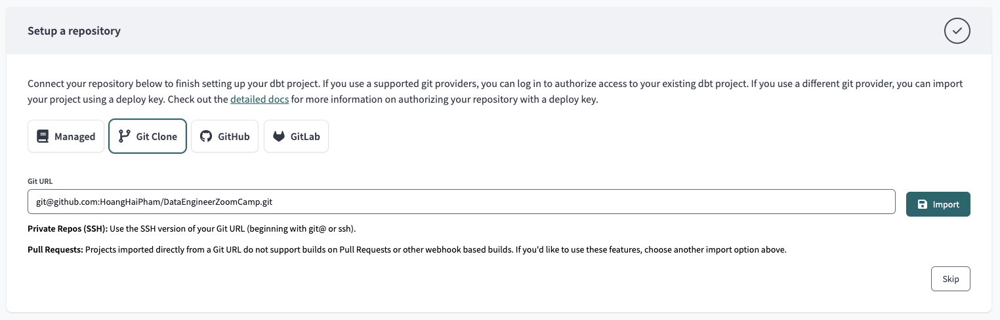 </td>
<td> 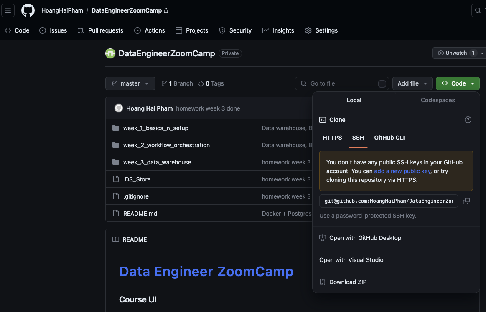 </td>
</tr></table>

2. You will get a deploy key, head to your GH repo and go to the `Settings` tab. Under security you'll find the menu `Deploy Keys`. Click on `Add deploy key` and paste the deploy key provided by dbt cloud. Make sure to tick on "write access".

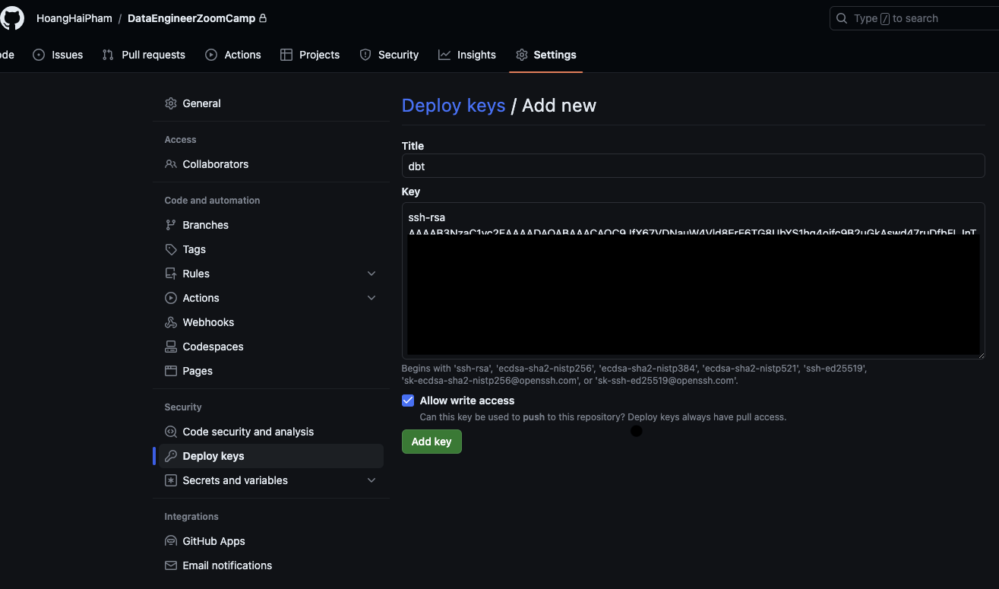

## Review your project settings

At the end, if you go to your projects it should look some like this:
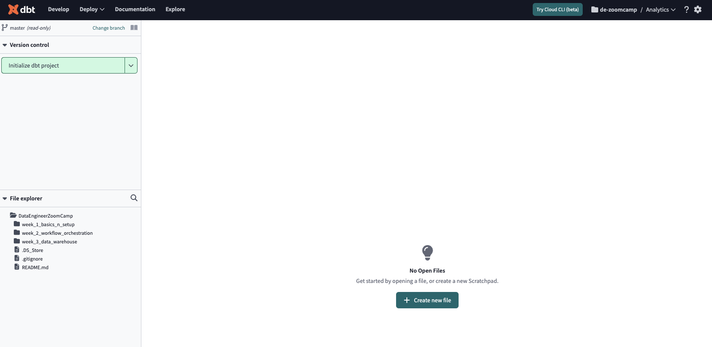

## (Optional) Link to your github account

You could simplify the process of adding and creating repositories by linking your GH account. [Official documentation](https://docs.getdbt.com/docs/dbt-cloud/cloud-configuring-dbt-cloud/cloud-installing-the-github-application)
