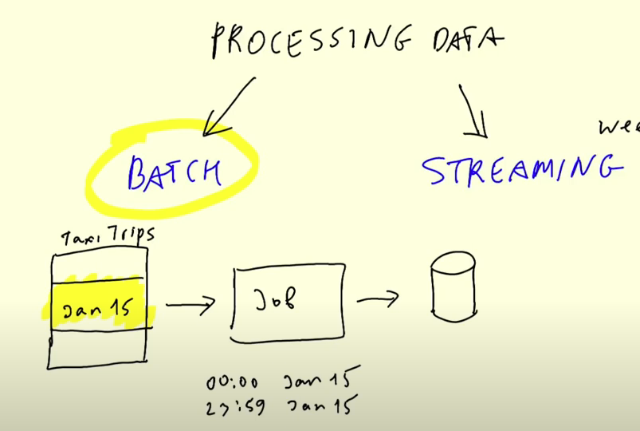
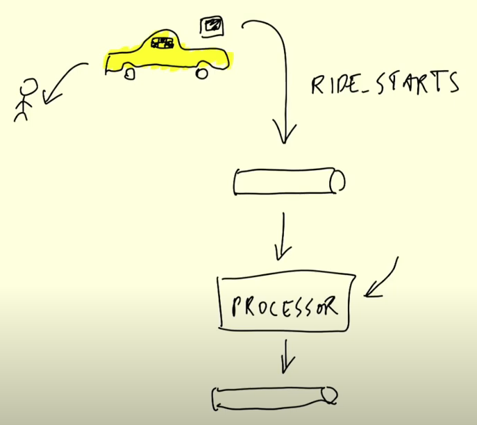
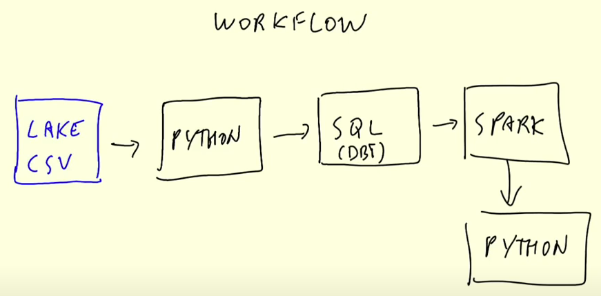
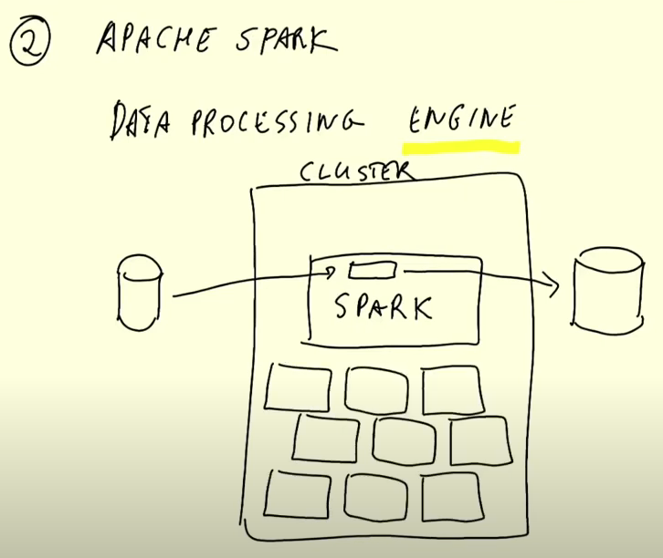
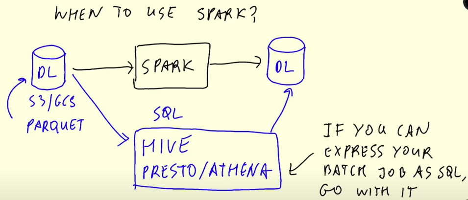
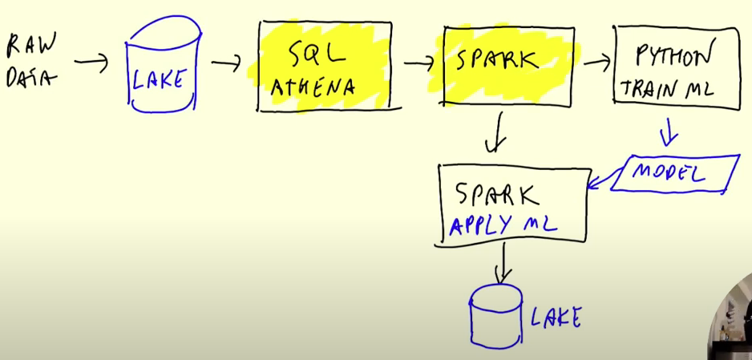
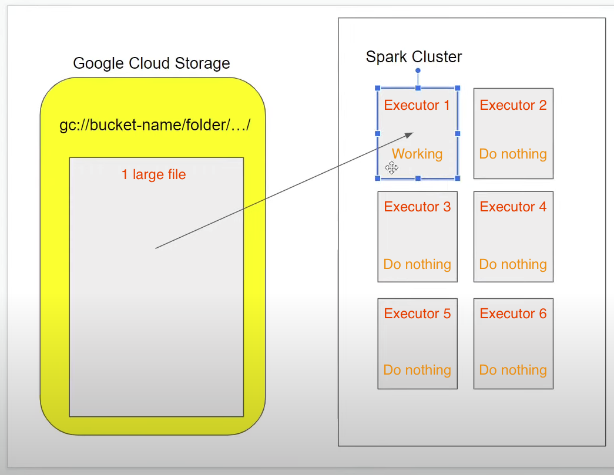
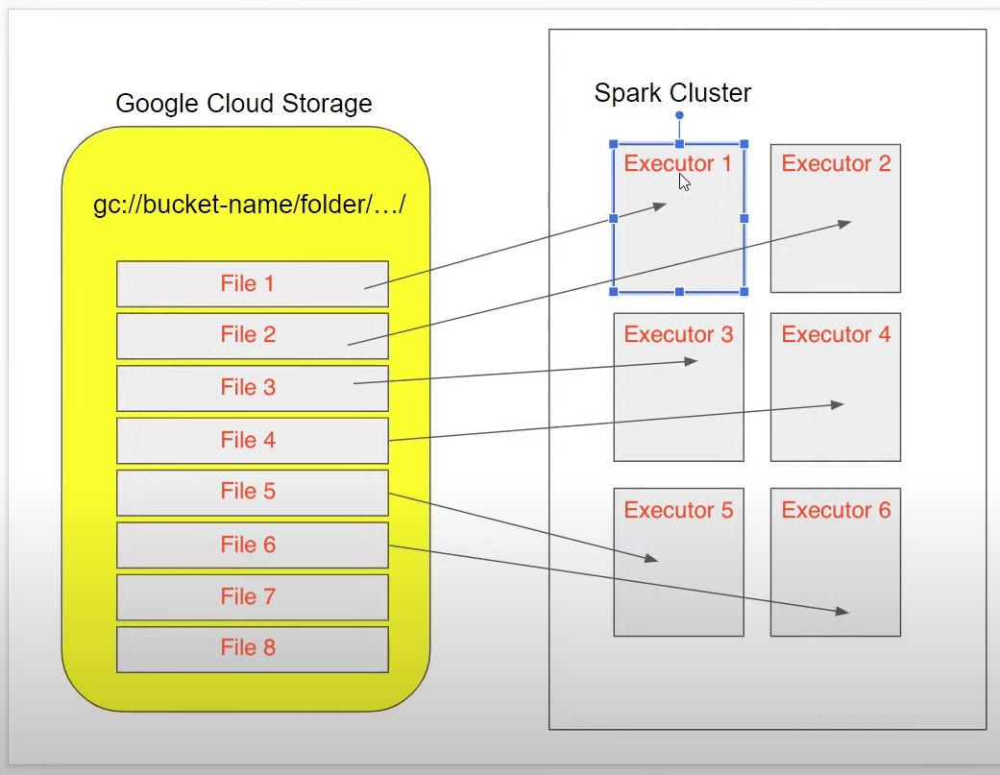
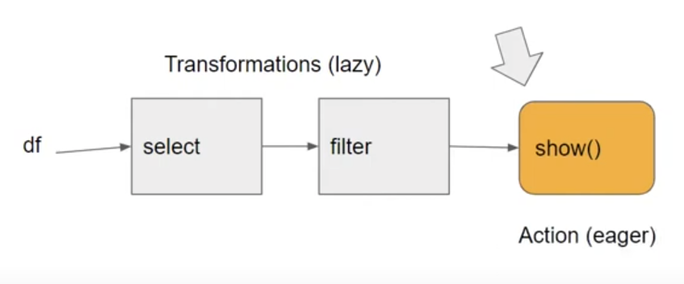

# What will be covered in this week?

- What is batch processing?
- Tool for batch processing: Spark
- What is Spark?
- Why do we need it?
- How to install?
- Features of Spark?
- RDDs concept
- How to use Docker to run Spark? or locally?
- Running Spark in the Cloud (GCP)
- Connecting Spark to DW

# Table of contents

- [DE Zoomcamp 5.1.1 - Introduction to Batch processing](#de-zoomcamp-511---introduction-to-batch-processing)
  - [Batch vs Stream processing](#batch-vs-stream-processing)
  - [Types of batch jobs](#types-of-batch-jobs)
  - [Workflow of batch jobs](#workflow-of-batch-jobs)
  - [Pros and cons of batch jobs](#pros-and-cons-of-batch-jobs)
- [DE Zoomcamp 5.1.2 - Introduction to Spark](#de-zoomcamp-512---introduction-to-spark)
  - [What is Spark?](#what-is-spark)
  - [Why do we need Spark?](#why-do-we-need-spark)
- [DE Zoomcamp 5.2.1 - (Optional) Installing Spark on Linux](#de-zoomcamp-521---optional-installing-spark-on-linux)
- [DE Zoomcamp 5.3.1 - First Look at Spark/PySpark](#de-zoomcamp-531---first-look-at-sparkpyspark)
  - [Reading CSV files & construct data type](#reading-csv-files--construct-data-type)
  - [Partitions](#partitions)
- [DE Zoomcamp 5.3.2 - Spark DataFrames](#de-zoomcamp-532---spark-dataframes)
  - [Actions vs Transformations](#actions-vs-transformations)
  - [Functions in Spark](#functions-in-spark)
  - [User Defined Functions (UDFs)](#user-defined-functions-udfs)

# [DE Zoomcamp 5.1.1 - Introduction to Batch processing](https://www.youtube.com/watch?v=dcHe5Fl3MF8&list=PL3MmuxUbc_hJed7dXYoJw8DoCuVHhGEQb&index=48)

### Batch vs Stream processing

There are 2 ways of processing data:

- `Batch processing`: processing _chunks_ of data at _regular intervals_.
  - Example: processing taxi trips each month.
    
- `Stream processing`: processing data _on the fly_.
  - Example: processing a taxi trip as soon as it's generated.
    

This lesson will cover `batch processing`. Next lesson will cover streaming.

### Types of batch jobs

A `batch job` is a **_job_** (a unit of work) that will process data in batches.

Batch jobs may be _scheduled_ in many ways:

- Weekly
- Daily (very common)
- Hourly (very common)
- X timnes per hous
- Every 5 minutes
- Etc...

Batch jobs may also be carried out using different technologies:

- Python scripts (like the `data pipelines in lesson 1`, getting csv file and ingesting to database with monthly intervals).
  - Python scripts can be run anywhere (Kubernets, AWS Batch, ...).
- SQL (like the `dbt models in lesson 4`), using SQL to transform data.
- Spark (what we will use for this lesson).
- Flink.
- Etc...

### Workflow of batch jobs

Batch jobs are commonly orchestrated with tools such as `Airflow` (week 2).

A common workflow for batch jobs may be the following:


### Pros and cons of batch jobs

- Advantages:
  - Easy to manage. There are multiple tools to manage them (the technologies we already mentioned)
  - Re-executable. Jobs can be easily retried if they fail.
  - Scalable. Scripts can be executed in more capable machines; Spark can be run in bigger clusters, etc.
- Disadvantages (`main disadvantage of batch processing`):
  - Delay. Each task of the workflow in the previous section may take a few minutes; assuming the whole workflow takes 20 minutes, we would need to wait those 20 minutes until the data is ready for work.

However, the advantages of `batch jobs` often compensate for its shortcomings, and as a result most companies that deal with data tend to work with batch jobs mos of the time (probably 80% for batch, 20% for stream).

# [DE Zoomcamp 5.1.2 - Introduction to Spark](https://www.youtube.com/watch?v=FhaqbEOuQ8U&list=PL3MmuxUbc_hJed7dXYoJw8DoCuVHhGEQb&index=52)

### What is Spark?

[Apache Spark](https://spark.apache.org/) is an open-source `multi-language` unified analytics `engine` for large-scale data processing.

Spark is an `engine` because it _processes data_.

Example we have a database/data lake, Spark pulls the data to its machines to its executors -> then it does something with the data -> then outputs it to again data lake/data warehouse -> the processing happens in Spark -> that's why it's an `engine`.



Spark can be ran in `clusters` with multiple `nodes`, each pulling and transforming data.

Spark is `multi-language` because we can use Java and Scala natively, and there are wrappers for Python, R and other languages.

The wrapper for Python is called [PySpark](https://spark.apache.org/docs/latest/api/python/).

Spark can deal with both `batches` and `streaming data`. The technique for streaming data is seeing a stream of data as a sequence of small batches and then applying similar techniques on them to those used on regular badges. We will cover streaming in detail in the next lesson.

### Why do we need Spark?

Spark is used for transforming data in a Data Lake. Since in Data Lake, you will have a bunch of files, then using SQL is not always easy => then you would go with Spark.

There are tools such as Hive, Presto or Athena (a AWS managed Presto) that allow you to express jobs as SQL queries on Data Lake.

However, there are times where you need to apply more complex manipulation which are very difficult or even impossible to express with SQL (such as ML models); in those instances, Spark is the tool to use.



A typical workflow may combine both tools. Here's an example of a workflow involving Machine Learning:



In this scenario, most of the preprocessing would be happening in Athena, so for everything that can be expressed with SQL, it's always a good idea to do so, but for everything else, there's Spark.

# [DE Zoomcamp 5.2.1 - (Optional) Installing Spark on Linux](https://www.youtube.com/watch?v=hqUbB9c8sKg&list=PL3MmuxUbc_hJed7dXYoJw8DoCuVHhGEQb&index=53)

Follow this folder to install Spark based on the OS: [setup folder](./setup/)

After installing the appropiate JDK and Spark, make sure that you set up [PySpark by following these instructions](./setup/pyspark.md).

Create file `.bashrc` to set permanent environment variables

```bash
nano ~/.bash_profile

# Copy into .bash_profile file
export GOOGLE_APPLICATION_CREDENTIALS="${HOME}/.google/credentials/google_credentials.json"
export PATH="${HOME}/bin:${PATH}"

export JAVA_HOME="/usr/local/Cellar/openjdk@11/11.0.22"
export PATH="${JAVA_HOME}/bin/:${PATH}"

export SPARK_HOME="/usr/local/Cellar/apache-spark/3.5.0/libexec"
export PATH="${SPARK_HOME}/bin/:${PATH}"

export PYTHONPATH="${SPARK_HOME}/python/:$PYTHONPATH"
export PYTHONPATH="${SPARK_HOME}/python/lib/py4j-0.10.9.7-src.zip:$PYTHONPATH"
```

Then save this file and run

```bash
source ~/.bash_profile
```

However, whenever the terminal is turned off, all the variables will be removed. In order to set it permanently, Open file `~/.zshrc` and paste this

```text
if [ -f ~/.bash_profile ]; then
  . ~/.bash_profile
fi
```

=> Save and close the file. Now, it should work.

Test your install by running this [Jupiter Notebook](./code/test-pyspark.ipynb).

To access `Interface of Spark master (Spark UI)`, using port 4041 => `localhost:4041`, there are all the jobs that we executed.

# [DE Zoomcamp 5.3.1 - First Look at Spark/PySpark](https://www.youtube.com/watch?v=r_Sf6fCB40c&list=PL3MmuxUbc_hJed7dXYoJw8DoCuVHhGEQb&index=54)

We can use Spark with Python code by means of PySpark. We will be using Jupyter Notebooks for this lesson.

We first need to import PySpark to our code:

```python
import pyspark
from pyspark.sql import SparkSession
```

We now need to instantiate a `Spark session`, an object that we use to interact with Spark.

```python
spark = SparkSession.builder \
    .master("local[*]") \
    .appName('test') \
    .getOrCreate()
```

- `SparkSession` is the class of the object that we instantiate. `builder` is the builder method.
- `master()` sets the Spark _master URL_ to connect to. The `local` string means that Spark will run on a local cluster. `[*]` means that Spark will run with as many CPU cores as possible.
- `appName()` defines the name of our application/session. This will show in the Spark UI.
- `getOrCreate()` will create the session or recover the object if it was previously created.

Once we've instantiated a session, we can access the Spark UI by browsing to `localhost:4041`. The UI will display all current jobs. Since we've just created the instance, there should be no jobs currently running.

### Reading CSV files & construct data type

Similarlly to Pandas, Spark can read CSV files into `dataframes`, a tabular data structure. Unlike Pandas, Spark can handle much bigger datasets but it's unable to infer the datatypes of each column.

> Note: Spark dataframes use custom data types; we cannot use regular Python types.

For this example we will use the [High Volume For-Hire Vehicle Trip Records for January 2021](https://d37ci6vzurychx.cloudfront.net/trip-data/fhvhv_tripdata_2021-01.parquet) available from the [NYC TLC Trip Record Data webiste](https://www1.nyc.gov/site/tlc/about/tlc-trip-record-data.page). The file should be about 720MB in size.

```bash
# Download file by command
!wget https://github.com/DataTalksClub/nyc-tlc-data/releases/download/fhvhv/fhvhv_tripdata_2021-01.csv.gz

# Extract the file
!gzip -f -d fhvhv_tripdata_2021-01.csv.gz

# Check rows of extracted file
!wc -l fhvhv_tripdata_2021-01.csv
```

Let's read the file and create a dataframe:

```python
df = spark.read \
    .option("header", "true") \
    .csv('fhvhv_tripdata_2021-01.csv')
```

- `read()` reads the file.
- `option()` contains options for the `read` method. In this case, we're specifying that the first line of the CSV file contains the column names.
- `csv()` is for readinc CSV files.

You can see the contents of the dataframe with `df.show()` (only a few rows will be shown) or `df.head()`. You can also check the current schema with `df.schema`; you will notice that all values are strings.

We can use a trick with Pandas to infer the datatypes:

1. Create a smaller CSV file with the first 1000 records or so.

   ```bash
   # Get the first 1001 rows of the original dataset
   !head -n 1001 fhvhv_tripdata_2021-01.csv > head.csv

   # Check rows of file
   !wc -l head.csv
   ```

2. Import Pandas and create a Pandas dataframe. This dataframe will have inferred datatypes.

   ```python
   import pandas as pd
   df_pandas = pd.read_csv("./head.csv")
   df_pandas.dtypes
   ```

3. Create a Spark dataframe from the Pandas dataframe and check its schema.

   ```python
   spark.createDataFrame(df_pandas).schema
   ```

4. Based on the output of the previous method, import `types` from `pyspark.sql` and create a `StructType` containing a list of the datatypes.

   ```python
   from pyspark.sql import types
   schema = types.StructType([...])
   ```

   - `types` contains all of the available data types for Spark dataframes.

5. Create a new Spark dataframe and include the schema as an option.

   ```python
   df = spark.read \
       .option("header", "true") \
       .schema(schema) \
       .csv('fhvhv_tripdata_2021-01.csv')
   ```

You may find an example Jupiter Notebook file using this trick [in this link](../week_5_batch/code/04_pyspark.ipynb).

### Partitions

A `Spark cluster` is composed of multiple `Executors`. Each executor can process data independently in order to parallelize and speed up work.

In the previous example we read a single large CSV file. A file can only be read by a single executor, which means that the code we've written so far isn't parallelized and thus will only be run by a single executor rather than many at the same time. The other executors will be `idle` (not do anything).


In order to solve this issue, we can `split one large file into multiple parts` so that each executor can take care of a part and have all executors working simultaneously. These splits are called `PARTITIONS`. File 7 & File 8 are left, so when the Executor 1 is done with processing File 1, it will pick File 7 to continue processing.


=> We will now read the CSV file, partition the dataframe and parquetize it. This will create multiple files in parquet format.

> Note: converting to parquet is an expensive operation which may take several minutes.

```python
# create 24 partitions in our dataframe
df = df.repartition(24)
# parquetize and write to fhvhv/2021/01/ folder
df.write.parquet('../../../data/fhvhv_partitions/2021/01')
```

You may check the Spark UI at any time and see the progress of the current job, which is divided into stages which contain tasks. The tasks in a stage will not start until all tasks on the previous stage are finished.

When creating a dataframe, Spark creates as many partitions as CPU cores available by default, and each partition creates a task. Thus, assuming that the dataframe was initially partitioned into 6 partitions, the `write.parquet()` method will have 2 stages: the first with 6 tasks and the second one with 24 tasks.

Besides the 24 parquet files, you should also see a `_SUCCESS` file which should be empty. This file is created when the job finishes successfully.

Trying to write the files again will output an error because Spark will not write to a non-empty folder. You can force an overwrite with the `mode` argument:

```python
df.write.parquet('../../../data/fhvhv_partitions/2021/01', mode='overwrite')
```

The opposite of partitioning (joining multiple partitions into a single partition) is called `coalescing`.

# [DE Zoomcamp 5.3.2 - Spark DataFrames](https://www.youtube.com/watch?v=ti3aC1m3rE8&list=PL3MmuxUbc_hJed7dXYoJw8DoCuVHhGEQb&index=55)

Spark works with `dataframes`.

We can create a dataframe from the parquet files we created in the previous section:

```python
df = spark.read.parquet('../../../data/fhvhv_partitions/2021/01')
```

Unlike CSV files, parquet files contain the schema of the dataset, so there is no need to specify a schema like we previously did when reading the CSV file. You can check the schema like this:

```python
df.printSchema()
```

(One of the reasons why parquet files are smaller than CSV files is because they store the data according to the datatypes, so integer values will take less space than long or string values.)

There are many Pandas-like operations that we can do on Spark dataframes, such as:

- Column selection - returns a dataframe with only the specified columns.
  ```python
  new_df = df.select('pickup_datetime', 'dropoff_datetime', 'PULocationID', 'DOLocationID')
  ```
- Filtering by value - returns a dataframe whose records match the condition stated in the filter.
  ```python
  new_df = df.select('pickup_datetime', 'dropoff_datetime', 'PULocationID', 'DOLocationID').filter(df.hvfhs_license_num == 'HV0003')
  ```
- And many more. The official Spark documentation website contains a [quick guide for dataframes](https://spark.apache.org/docs/latest/api/python/getting_started/quickstart_df.html).

### Actions vs Transformations

Some Spark methods are "lazy", meaning that they are not executed right away. You can test this with the last instructions we run in the previous section: after running them, the Spark UI will not show any new jobs. However, running `df.show()` right after will execute right away and display the contents of the dataframe; the Spark UI will also show a new job.

These lazy commands are called `transformations` and the eager commands are called `actions`. Computations only happen when `actions are triggered`.

```python
df.select(...).filter(...).show()
```

Both `select()` and `filter()` are _transformations_, but `show()` is an _action_. The whole instruction gets evaluated only when the `show()` action is triggered.



- List of `Transformations` (lazy):

  - Selecting columns
  - Filtering
  - Joins
  - Group by
  - Partitions
  - ...

- List of `Actions` - eager (executed immediately):

  - Show, take, head
  - Write, read
  - ...

### Functions in Spark

Besides the SQL and Pandas-like commands we've seen so far, Spark provides additional built-in functions that allow for more complex data manipulation. By convention, these functions are imported as follows:

```python
from pyspark.sql import functions as F
```

Here's an example of built-in function usage:

```python
df \
    .withColumn('pickup_date', F.to_date(df.pickup_datetime)) \
    .withColumn('dropoff_date', F.to_date(df.dropoff_datetime)) \
    .select('pickup_date', 'dropoff_date', 'PULocationID', 'DOLocationID') \
    .show()
```

- `withColumn()` is a `transformation` that adds a new column to the dataframe.
  - **_IMPORTANT_**: adding a new column with the same name as a previously existing column will overwrite the existing column!
- `select()` is another `transformation` that selects the stated columns.
- `F.to_date()` is a built-in Spark function that converts a timestamp to date format (year, month and day only, no hour and minute).

A list of built-in functions is available [in the official Spark documentation page](https://spark.apache.org/docs/latest/api/sql/index.html).

### User Defined Functions (UDFs)

Besides these built-in functions, Spark allows us to create **_User Defined Functions_** (UDFs) with custom behavior for those instances where creating SQL queries for that behaviour becomes difficult both to manage and test.

UDFs are regular functions which are then passed as parameters to a special builder. Let's create one:

```python
# A crazy function that changes values when they're divisible by 7 or 3
def crazy_stuff(base_num):
    num = int(base_num[1:])
    if num % 7 == 0:
        return f's/{num:03x}'
    elif num % 3 == 0:
        return f'a/{num:03x}'
    else:
        return f'e/{num:03x}'

# Creating the actual UDF
crazy_stuff_udf = F.udf(crazy_stuff, returnType=types.StringType())
```

- `F.udf()` takes a function (`crazy_stuff()` in this example) as parameter as well as a return type for the function (a string in our example).
- While `crazy_stuff()` is obviously non-sensical, UDFs are handy for things such as ML and other complex operations for which SQL isn't suitable or desirable. Python code is also easier to test than SQL.

We can then use our UDF in transformations just like built-in functions:

```python
df \
    .withColumn('pickup_date', F.to_date(df.pickup_datetime)) \
    .withColumn('dropoff_date', F.to_date(df.dropoff_datetime)) \
    .withColumn('base_id', crazy_stuff_udf(df.dispatching_base_num)) \
    .select('base_id', 'pickup_date', 'dropoff_date', 'PULocationID', 'DOLocationID') \
    .show()
```
