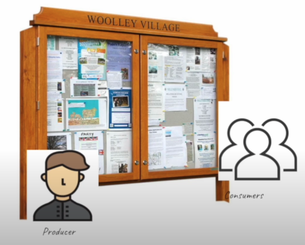
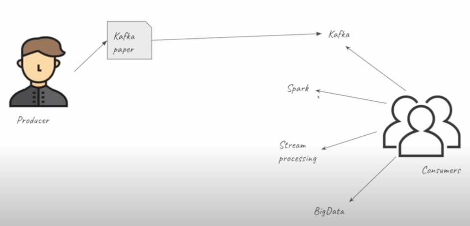
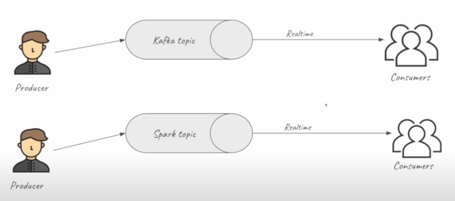

# Table of contents

- [DE Zoomcamp 6.0.1-Introductio](#de-zoomcamp-601-introduction)
- [DE Zoomcamp 6.0.2-What is stream processing](#de-zoomcamp-602-what-is-stream-processing)
  - [Data exchange](#data-exchange)
  - [Stream processing](#stream-processing)

# [DE Zoomcamp 6.0.1-Introduction](https://www.youtube.com/watch?v=hfvju3iOIP0&list=PL3MmuxUbc_hJed7dXYoJw8DoCuVHhGEQb&index=67)

- What is stream processing?
- What is Kafka?
- How does Kafka plays a role in stream processing?
- Some of the message properties of stream processing.
- Configuration parameters specific to Kafka.
- Time surrounding in stream processing.
- Kafka producers & Kafka consumers.
- How actually data is partitioned inside stream processing.
- Example of how to work with Kafka stream (Java).
- Spark streaming python examples.
- Schema and it's roles in stream processing.

# [DE Zoomcamp 6.0.2-What is stream processing](https://www.youtube.com/watch?v=WxTxKGcfA-k&list=PL3MmuxUbc_hJed7dXYoJw8DoCuVHhGEQb&index=68)

In this lesson, we will discuss what `stream processing` is. But before we dive into that, let's first talk about `data exchange`.

### Data exchange

`Data exchange` can occur through various channels. In the real world, a common form of `data exchange` is when a producer posts a flyer on a notice board to share information with the public. On the other hand, consumers or users passing by can read, react, or take necessary actions based on the information provided, or simply ignore it if it's not relevant to them.

Regarding computer communication, we often refer to APIs such as REST, GraphQL, and webhooks. The concept remains the same - one computer shares information or data, which is then exchanged through these services. Imagine you are a consumer interested in specific topics like Kafka, Spark stream processing, and Big Data. As a producer, I can attach my flyer to a particular topic.

### Stream processing

Unlike batch mode, data is exchanged more dynamically in stream processing. The data is exchanged in `real time, without any delays`. In this example, the producer sends data to a Kafka topic. The Kafka topic receives the message instantly and delivers it to the consumer right away.

To clarify what we mean by `real time`. It doesn't mean instantaneously like the speed of light. There might be a few seconds of delay. Nevertheless, it is much faster than before. In `batch processing`, data is consumed every minute or every hour, but in real time (`stream processing`), the messages come in much faster.

