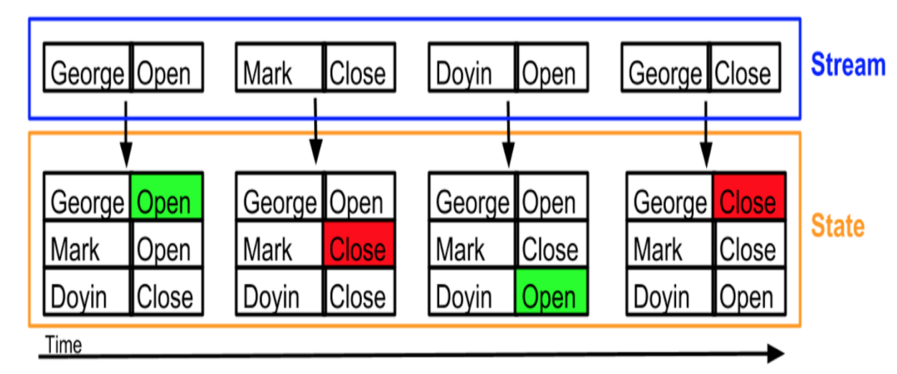
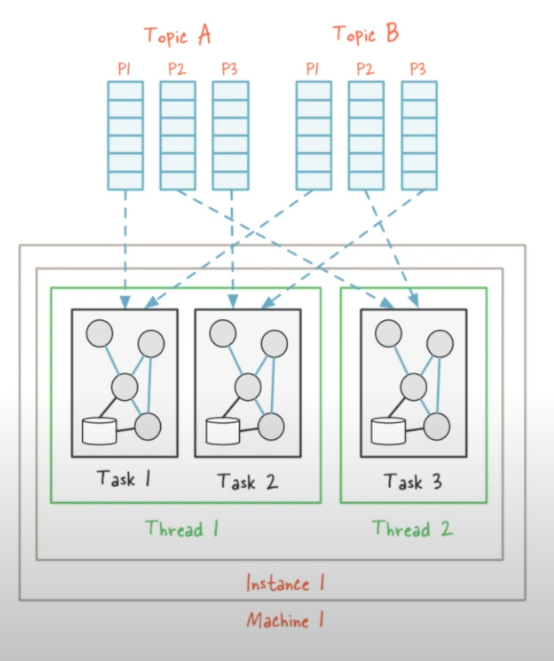

# Table of contents

- [DE Zoomcamp 6.1-Introductio](#de-zoomcamp-61-introduction)
- [DE Zoomcamp 6.2-What is stream processing](#de-zoomcamp-62-what-is-stream-processing)
  - [Data exchange](#data-exchange)
  - [Stream processing](#stream-processing)
- [DE Zoomcamp 6.3-What is kafka?](#de-zoomcamp-63-what-is-kafka)
  - [Basic Kafka components - Topic](#basic-kafka-components---topic)
  - [Basic Kafka components - Events](#basic-kafka-components---events)
  - [Basic Kafka components - Logs](#basic-kafka-components---logs)
  - [Basic Kafka components - Message](#basic-kafka-components---message)
  - [Basic Kafka components - Broker & Cluster](#basic-kafka-components---broker--cluster)
  - [Intermission: visualizing the concepts so far](#intermission-visualizing-the-concepts-so-far)
  - [consumer_offsets](#consumer_offsets)
  - [Consumer Groups](#consumer-groups)
  - [Partitions](#partitions)
  - [Replication](#replication)
  - [What makes Kafka special?](#what-makes-kafka-special)
  - [Stream processing in real-world scenarios](#stream-processing-in-real-world-scenarios)
- [DE Zoomcamp 6.4-Confluent cloud](#de-zoomcamp-64-confluent-cloud)
  - [Using Docker](#using-docker)
  - [Using Confluent](#using-confluent)
    - [Create cluster](#create-cluster)
    - [Create API Key](#create-api-key)
    - [Create topic](#create-topic)
    - [Produce a message](#produce-a-message)
    - [Connectors](#connectors)
- [DE Zoomcamp 6.5-Kafka producer consumer](#de-zoomcamp-65-kafka-producer-consumer)
- [DE Zoomcamp 6.6-Kafka configuration](#de-zoomcamp-66-kafka-configuration)
- [DE Zoomcamp 6.7-Kafka stream basics](#de-zoomcamp-67-kafka-streams-basics)
- [DE Zoomcamp 6.8-Kafka stream join](#de-zoomcamp-68-kafka-stream-join)
- [DE Zoomcamp 6.9-Kafka stream testing](#de-zoomcamp-69-kafka-stream-testing)
- [DE Zoomcamp 6.10-Kafka stream windowing](#de-zoomcamp-610-kafka-stream-windowing)
- [DE Zoomcamp 6.11-Kafka ksqldb & Connect](#de-zoomcamp-611-kafka-ksqldb--connect)
- [DE Zoomcamp 6.12-Kafka Schema registry](#de-zoomcamp-612-kafka-schema-registry)
- [DE Zoomcamp 6.13-Kafka Streaming with Python](#de-zoomcamp-613-kafka-streaming-with-python)
  - [Json example](#json-example)
  - [Introduction to Avro](#introduction-to-avro)
- [DE Zoomcamp 6.14-Pyspark Structured Streaming](#de-zoomcamp-614-pyspark-structured-streaming)

# [DE Zoomcamp 6.1-Introduction](https://www.youtube.com/watch?v=hfvju3iOIP0&list=PL3MmuxUbc_hJed7dXYoJw8DoCuVHhGEQb&index=67)

- What is stream processing?
- What is Kafka?
- How does Kafka plays a role in stream processing?
- Some of the message properties of stream processing.
- Configuration parameters specific to Kafka.
- Time surrounding in stream processing.
- Kafka producers & Kafka consumers.
- How actually data is partitioned inside stream processing.
- Example of how to work with Kafka stream (Java).
- Spark streaming python examples.
- Schema and it's roles in stream processing.

# [DE Zoomcamp 6.2-What is stream processing](https://www.youtube.com/watch?v=WxTxKGcfA-k&list=PL3MmuxUbc_hJed7dXYoJw8DoCuVHhGEQb&index=68)

In this lesson, we will discuss what `stream processing` is. But before we dive into that, let's first talk about `data exchange`.

### Data exchange

`Data exchange` can occur through various channels. In the real world, a common form of `data exchange` is when a producer posts a flyer on a notice board to share information with the public. On the other hand, consumers or users passing by can read, react, or take necessary actions based on the information provided, or simply ignore it if it's not relevant to them.


Regarding computer communication, we often refer to APIs such as REST, GraphQL, and webhooks. The concept remains the same - one computer shares information or data, which is then exchanged through these services. Imagine you are a consumer interested in specific topics like Kafka, Spark stream processing, and Big Data. As a producer, I can attach my flyer to a particular topic.


### Stream processing

Unlike batch mode, data is exchanged more dynamically in stream processing. The data is exchanged in `real time, without any delays`. In this example, the producer sends data to a Kafka topic. The Kafka topic receives the message instantly and delivers it to the consumer right away.

To clarify what we mean by `real time`. It doesn't mean instantaneously like the speed of light. There might be a few seconds of delay. Nevertheless, it is much faster than before. In `batch processing`, data is consumed every minute or every hour, but in real time (`stream processing`), the messages come in much faster.


# [DE Zoomcamp 6.3-What is kafka?](https://www.youtube.com/watch?v=zPLZUDPi4AY&list=PL3MmuxUbc_hJed7dXYoJw8DoCuVHhGEQb&index=69)

We will explore Kafka streaming and how we can use it as a central streaming architecture for our similar notice board example. We will delve into the details of Kafka, including its scalability, robustness, and configuration.

Kafka is used to upgrade from a project architecture like this...


...to an architecture like this:


`Apache Kafka` is a **_message broker_** and **_stream processor_**. Kafka is used to handle `real-time data` feeds. Kafka works by allowing producers to send messages which are then pushed in real time by Kafka to consumers. Kafka is hugely popular and most technology-related companies use it.

You can also check out this [animated comic](https://www.gentlydownthe.stream/) to learn more about Kafka.

- In the example of notice board, we have two topics: ABC topic and XYZ topic.
  - `Producers` who produce data to these topics, which can be relevant to specific use cases or scenarios.
  - `Consumers` are those that consume the data from these topics: web pages, micro services, apps, etc.

Connecting consumers to producers directly can lead to an amorphous and hard to maintain architecture in complex projects like the one in the first image. Kafka solves this issue by becoming an intermediary that all other components connect to.


### Basic Kafka components - Topic

A topic is an abstraction of a concept. Concepts can be anything that makes sense in the context of the project, such as "sales data", "new members", "clicks on banner", etc. A producer pushes a message to a topic, which is then consumed by a consumer subscribed to that topic.

Kafka uses the term `topic` extensively, What is `topic`? It's a continuous stream of `events`.


### Basic Kafka components - Events

And what is `events`? These `events`, over time, are simply data points at a specific timestamp. The collection of these `events` goes into our `topic`, and our consumer in Kafka reads these `events`.

### Basic Kafka components - Logs

Kafka stores data in the form of logs, which is the way events are stored in a topic. When discussing logs, we are essentially discussing how data is stored within the topic. Logs store messages in an ordered fashion. Kafka assigns a sequence ID in order to each new message and then stores it in logs.

### Basic Kafka components - Message

The basic communication abstraction used by producers and consumers in order to share information in Kafka is called a `message`. It consists of three main components:

- `Key`: used to identify the message and for additional Kafka stuff such as partitions (covered later).
- `Value`: the actual information that producers push and consumers are interested in.
- `Timestamp`: indicates the exact time when the message was created, used for logging.


### Basic Kafka components - Broker & Cluster

A `Kafka broker` is a machine (physical or virtualized) on which Kafka is running.

A `Kafka cluster` is a collection of brokers (nodes) working together.

### Intermission: visualizing the concepts so far

Here's how a producer and a consumer would talk to the same Kafka broker to send and receive messages.

- Producer sending messages to Kafka.

  

  1. The producer first declares the topic it wants to "talk about" to Kafka. In this example, the topic will be `abc`. Kafka will then assign a _physical location_ on the hard drive for that specific topic (the topic logs).
  2. The producer then sends messages to Kafka (in our example, messages 1, 2 and 3).
  3. Kafka assigns an ID to the messages and writes them to the logs.
  4. Kafka sends an acknowledgement to the producer, informing it that the messages were successfully sent and written.

- Consumer receiving messages

  Broker and logs are the same as those in the first graph; the graph has been split in 2 for clarity.

  

  1. The consumer declares to Kafka that it wants to read from a particular topic. In our example, the topic is `abc`.
  2. Kafka checks the logs and figures out which messages for that topic have been read and which ones are unread.
  3. Kafka sends the unread messages to the consumer.
  4. The consumer sends an acknowledgement to Kafka, informint it that the messages were successfully received.

### consumer_offsets

The workflows work fine for a single consumer but it omits how it keeps track of read messages. It also doesn't show what would happen if 2 or more consumers are consuming messages for the same topic.

**_`__consumer_offsets`_** is a special topic that keeps track of messages read by each consumer and topic. In other words: _Kafka uses itself_ to keep track of what consumers do.

When a consumer reads messages and Kafka receives the ack, Kafka posts a message to `__consumer_offsets` with the consumer ID, the topic and the message IDs that the consumer has read. If the consumer dies and spawns again, Kafka will know the last message delivered to it in order to resume sending new ones. If multiple consumers are present, Kafka knows which consumers have read which messages, so a message that has been read by consumer #1 but not by #2 can still be sent to #2.

### Consumer Groups

A `consumer group` is composed of multiple consumers.

In regards of controlling read messages, Kafka treats all the consumers inside a consumer group as a _single entity_: when a consumer inside a group reads a message, that message will **_NOT_** be delivered to any other consumer in the group.

Consumer groups allow consumer apps to scale independently: a consumer app made of multiple consumer nodes will not have to deal with duplicated or redundant messages.

Consumer groups have IDs and all consumers within a group have IDs as well.

The default value for consumer groups is 1. All consumers belong to a consumer group.

### Partitions

> Note: do not confuse BigQuery or Spark partitions with Kafka partitions; they are different concepts.

Topic logs in Kafka can be **_partitioned_**. A topic is essentially a _wrapper_ around at least 1 partition.

Partitions are assigned to consumers inside consumer groups:

- **_A partition_** is assigned to **_one consumer only_**.
- **_One consumer_** may have **_multiple partitions_** assigned to it.
- If a consumer dies, the partition is reassigned to another consumer.
- Ideally there should be as many partitions as consumers in the consumer group.
  - If there are more partitions than consumers, some consumers will receive messages from multiple partitions.
  - If there are more consumers than partitions, the extra consumers will be idle with nothing to do.

Partitions in Kafka, along with consumer groups, are a scalability feature. Increasing the amount of partitions allows the consumer group to increase the amount of consumers in order to read messages at a faster rate. Partitions for one topic may be stored in separate Kafka brokers in our cluster as well.

Messages are assigned to partitions inside a topic by means of their **_key_**: message keys are hashed and the hashes are then divided by the amount of partitions for that topic; the remainder of the division is determined to assign it to its partition. In other words: _hash modulo partition amount_.

- While it would be possible to store messages in different partitions in a round-robin way, this method would not keep track of the _message order_.
- Using keys for assigning messages to partitions has the risk of making some partitions bigger than others. For example, if the topic `client` makes use of client IDs as message keys and one client is much more active than the others, then the partition assigned to that client will grow more than the others. In practice however this is not an issue and the advantages outweight the cons.


### Replication

Partitions are **_replicated_** accross multiple brokers in the Kafka cluster as a fault tolerance precaution.

When a partition is replicated accross multiple brokers, one of the brokers becomes the **_leader_** for that specific partition. The leader handles the message and writes it to its partition log. The partition log is then replicated to other brokers, which contain **_replicas_** for that partition. Replica partitions should contain the same messages as leader partitions.

If a broker which contains a leader partition dies, another broker becomes the leader and picks up where the dead broker left off, thus guaranteeing that both producers and consumers can keep posting and reading messages.

We can define the _replication factor_ of partitions at topic level. A replication factor of 1 (no replicas) is undesirable, because if the leader broker dies, then the partition becomes unavailable to the whole system, which could be catastrophic in certain applications.

### What makes Kafka special?

In terms of data exchange, Kafka provides `robustness`, `flexibility`, and `scalability` as its core features.

Kafka provides a feature called `replication`, which allows Kafka to replicate data across different fields. This ensures the `robustness` and `reliability` needed for building a stream processing system. Event if your servers or nodes go down, you will still receive the data.

It also provides `flexibility`, allowing topics to be of any size and accommodating multiple consumers. Kafka allows you to store data cost-effectively while still having access to it for offline analysis or retrieval into the topic. This allows some messages to be stored for a longer period of time. Just because one consumer has read the message doesn't mean that other consumers cannot read it anymore

Kafka is highly `scalable`, meaning it can handle an increase in data size from 10 events per second to 1000 events per second without any issues. This is one of the main reasons why Kafka is so popular in the streaming space.


### Stream processing in real-world scenarios

Not too long ago, our architecture consisted of `monoliths` that primarily interacted with a central database. These `monoliths` were typically large pieces of code that could communicate with one or multiple databases.

However, this architecture started causing issues. Without going into too much detail about `monoliths` versus `microservices`, the current trend is to move towards `microservices`. In this case, we now have many small applications that together form the microservice architecture.

These `microservices` still need to communicate with each other. They can do so through APIs, message passing, or by accessing a central database that is accessible to all of them. Sometimes, `microservices` may have access to specific databases while others do not. This architecture works well as long as the microservices and data size are not too large.


However, as the number of `microservices` and data increases, it becomes necessary to have a consistent message passing or streaming service. In this case, one microservice typically writes to a Kafka topic, which represents events, and other trusted `microservices` can consume these events.

Sometimes, it's required to have multiple data sources, so these `microservices` work closely with the database or the monolith service. In this case, we will have Kafka messages, and the database would be able to write to the Kafka topic. Any microservice interested can read from these Kafka topics, and the process is called `CDC (Change Data Capture)`.


# [DE Zoomcamp 6.4-Confluent cloud](https://www.youtube.com/watch?v=ZnEZFEYKppw&list=PL3MmuxUbc_hJed7dXYoJw8DoCuVHhGEQb&index=70)

Install instructions for Kafka can be found in [the official website](https://kafka.apache.org/quickstart#quickstart_kafkaconnect).

### Using Docker

Due to the complexity of managing a manual Kafka install, a docker-compose script is provided [in this link](https://github.com/ziritrion/dataeng-zoomcamp/blob/main/6_streaming/docker-compose.yml). The Docker images are provided by [Confluent](https://www.confluent.io/), a Kafka tool vendor. The script defines the following services:

- **[`zookeeper`](https://zookeeper.apache.org/)**: a centralized service for maintaining configuration info. Kafka uses it for maintaining metadata knowledge such as topic partitions, etc.
  - Zookeeper is being phased out as a dependency, but for easier deployment we will use it in the lesson.
- **`broker`**: the main service. A plethora of environment variables are provided for easier configuration.
  - The image for this service packages both Kafka and [Confluent Server](https://docs.confluent.io/platform/current/installation/migrate-confluent-server.html), a set of commercial components for Kafka.
- **`kafka-tools`**: a set of additional Kafka tools provided by [Confluent Community](https://www.confluent.io/community/#:~:text=Confluent%20proudly%20supports%20the%20community,Kafka%C2%AE%EF%B8%8F%2C%20and%20its%20ecosystems.). We will make use of this service later in the lesson.
- **`schema-registry`**: provides a serving layer for metadata. We will make use of this service later in the lesson.
- **`control-center`**: a web-based Kafka GUI.
  - Kafka can be entirely used with command-line tools, but the GUI helps us visualize things.

Download the script to your work directory and start the deployment with `docker-compose up` . It may take several minutes to deploy on the first run. Check the status of the deployment with `docker ps` . Once the deployment is complete, access the control center GUI by browsing to `localhost:9021` .

### Using Confluent

we are gonna set up our Confluent Cloud free trial that basically allows you to have a Kafka cluster. Confluent provides 30 days free trial with 400$ and it can be easily connected to Cloud services such as GCP. Most of the things you will do in here would be free you would not need a credit card or debit card and it's an easy way to set this up.

#### Create cluster

Firstly, what we need to do is basically create a cluster. Let's use GCP at location Frankfurt.


Next step will be payment method, we can skip this step.

Then we are going to name our clusters as `kafka_tutorial_cluster`, and click "Launch cluster".


This is the view when the cluster is successfully created.


#### Create API Key

We need an API key to interact with the Confluent; therefore we are going to create an API key by following steps:


Enter the "Description" field: `kafka_tutorial_api_key`. Then select "Download and Continue". Save the API file on your local machine.

#### Create topic

Next step, we are going to create a topic named as `kafka_tutorial` with the `Partitions` is 2, `Retention time` is 1 day in `Advance setting`, because we don't want to pay a lot. Then click "Save and Create" button.


#### Produce a message

Next step we will create a message in Confluent by following these steps:


#### Connectors

Let's create a dummy `Connector`, in this case we are going to use `Sample Data`.


Generate the API key & download to your local machine.


After a few minutes, the `Connector` is successfully create. We can go to the `Topic` and check the `Message` that we are receving streaming message from the `Connector`.


_**NOTE:**_ In order to save the credit, pause/turn off the `Connector` when not using.


# [DE Zoomcamp 6.5-Kafka producer consumer](https://www.youtube.com/watch?v=aegTuyxX7Yg&list=PL3MmuxUbc_hJed7dXYoJw8DoCuVHhGEQb&index=71)

In this course, we will also programmatically consume data using Java as the programming language. Kafka libraries are well maintained for Java, while Python is not as well maintained currently.

we will use the Confluent cloud. The first step is to create a topic for `rides data`. Click `Add topic` and configure as following:


Next, we will connect it to a `client`. The `client` provides examples on how to do this, particularly in Java. We will follow the configuration instructions provided.

Download the source code for [Java example with Kafka](https://github.com/DataTalksClub/data-engineering-zoomcamp/tree/main/06-streaming/java/kafka_examples_) and then follow along the tutorials for writing the Java code.

# [DE Zoomcamp 6.6-Kafka configuration](https://www.youtube.com/watch?v=SXQtWyRpMKs&list=PL3MmuxUbc_hJed7dXYoJw8DoCuVHhGEQb&index=72)

[](https://www.youtube.com/watch?v=SXQtWyRpMKs&list=PL3MmuxUbc_hJed7dXYoJw8DoCuVHhGEQb&index=72)

[Kafka Configuration Reference](https://docs.confluent.io/platform/current/installation/configuration/)

This section will cover different settings and properties accross Kafka actors.

### Topic configurations

- `retention.ms`: due to storage space limitations, messages can't be kept indefinitely. This setting specifies the amount of time (in milliseconds) that a specific topic log will be available before being deleted.
- `cleanup.policy`: when the `retention.ms` time is up, we may choose to `delete` or `compact` a topic log.
  - Compaction does not happen instantly; it's a batch job that takes time.
- `partition`: number of partitions.
  - The higher the amount, the more resources Kafka requires to handle them. Remember that partitions will be replicated across brokers; if a broker dies we could easily overload the cluster.
- `replication`: replication factor; number of times a partition will be replicated.

### Consumer configurations

- `offset`: sequence of message IDs which have been read by the consumer.
- `consumer.group.id`: ID for the consumer group. All consumers belonging to the same group contain the same `consumer.group.id`.
- `auto_offset_reset`: when a consumer subscribes to a pre-existing topic for the first time, Kafka needs to figure out which messages to send to the consumer.
  - If `auto_offset_reset` is set to `earliest`, all of the existing messages in the topic log will be sent to the consumer.
  - If `auto_offset_reset` is set to `latest`, existing old messages will be ignored and only new messages will be sent to the consumer.

### Producer configurations

- `acks`: behaviour policy for handling acknowledgement signals. It may be set to `0`, `1` or `all`.
  - `0`: "fire and forget". The producer will not wait for the leader or replica brokers to write messages to disk.
    - Fastest policy for the producer. Useful for time-sensitive applications which are not affected by missing a couple of messages every so often, such as log messages or monitoring messages.
  - `1`: the producer waits for the leader broker to write the messaage to disk.
    - If the message is processed by the leader broker but the broker inmediately dies and the message has not been replicated, the message is lost.
  - `all`: the producer waits for the leader and all replica brokers to write the message to disk.
    - Safest but slowest policy. Useful for data-sensitive applications which cannot afford to lose messages, but speed will have to be taken into account.

# [DE Zoomcamp 6.7-Kafka streams basics](https://www.youtube.com/watch?v=dUyA_63eRb0&list=PL3MmuxUbc_hJed7dXYoJw8DoCuVHhGEQb&index=73)

[](https://www.youtube.com/watch?v=dUyA_63eRb0&list=PL3MmuxUbc_hJed7dXYoJw8DoCuVHhGEQb&index=73)

### What is Kafka Streams?

[Streams Concepts](https://docs.confluent.io/platform/current/streams/concepts.html)

[Kafka Streams](https://kafka.apache.org/documentation/streams/) is a _client library_ for building applications and services whose input and output are stored in Kafka clusters. In other words: _Streams applications_ consume data from a Kafka topic and produce it back into another Kafka topic.

Kafka Streams is fault-tolerant and scalable, and apps using the Streams library benefit from these features: new instances of the app can be added or killed and Kafka will balance the load accordingly. Streams can process events with latency of miliseconds, making it possible for applications to deal with messages as soon as they're available. Streams also provides a convenient [Domain Specific Language (Streams DSL)](https://docs.confluent.io/platform/current/streams/developer-guide/dsl-api.html) that simplifies the creation of Streams services.

Kafka Streams is both powerful and simple to use. Other solutions like Spark or Flink are considered more powerful but they're much harder to use, and simple Kafka consumers (like the ones we've created so far) are simple but not as powerful as apps using Streams. However, keep in mind that Streams apps can only work with Kafka; if you need to deal with other sources then you need other solutions.

### Streams vs State

When dealing with streaming data, it's important to make the disctinction between these 2 concepts:

- **_Streams_** (aka **_KStreams_**) are _individual messages_ that are read sequentially.
- **_State_** (aka **_KTable_**) can be thought of as a _stream changelog_: essentially a table which contains a _view_ of the stream at a specific point of time.
  - KTables are also stored as topics in Kafka.



### Streams topologies and features

A **_topology_** (short for _processor topology_) defines the _stream computational logic_ for our app. In other words, it defines how input data is transformed into output data.

Essentially, a topology is a graph of _stream processors_ (the graph nodes) which are connected by _streams_ (the graph edges). A topology is a useful abstraction to design and understand Streams applications.

A **_stream processor_** is a node which represents a processing step (i.e. it transforms data), such as map, filter, join or aggregation.

Stream processors (and thus topologies) are defined via the imperative Processor API or with the declarative, functional DSL. We will focus on DSL in this lesson.

Kafka Streams provides a series of features which stream processors can take advantage of, such as:

- Aggregates (count, groupby)
- Stateful processing (stored internally in a Kafka topic)
- Joins (KStream with Kstream, KStream with KTable, Ktable with KTable)
- [Windows](https://kafka.apache.org/20/documentation/streams/developer-guide/dsl-api.html#windowing) (time based, session based)
  - A window is a group of records that have the same key, meant for stateful operations such as aggregations or joins.

# [DE Zoomcamp 6.8-Kafka stream join](https://www.youtube.com/watch?v=NcpKlujh34Y&list=PL3MmuxUbc_hJed7dXYoJw8DoCuVHhGEQb&index=74)

[](https://www.youtube.com/watch?v=NcpKlujh34Y&list=PL3MmuxUbc_hJed7dXYoJw8DoCuVHhGEQb&index=74)

Streams support the following Joins:

- **_Outer_**
- **_Inner_**
- **_Left_**

Tables and streams can also be joined in different combinations:

- **_Stream to stream join_** - always **_windowed_** (you need to specify a certain timeframe).
- **_Table to table join_** - always NOT windowed.
- **_Stream to table join_**.

You may find out more about how they behave [in this link](https://blog.codecentric.de/en/2017/02/crossing-streams-joins-apache-kafka/).

The main difference is that joins between streams are _windowed_ ([see below](#windowing)), which means that the joins happen between the "temporal state" of the window, whereas joins between tables aren't windowed and thus happen on the actual contents of the tables.

### Timestamps

So far we have covered the key and value attributes of a Kafka message but we have not covered the timestamp.

Every event has an associated notion of time. Kafka Streams bases joins and windows on these notions. We actually have multiple timestamps available depending on our use case:

- **_Event time_** (extending `TimestampExtractor`): timestamp built into the message which we can access and recover.
- **_Processing time_**: timestamp in which the message is processed by the stream processor.
- **_Ingestion time_**: timestamp in which the message was ingested into its Kafka broker.

# [DE Zoomcamp 6.9-Kafka stream testing](https://www.youtube.com/watch?v=TNx5rmLY8Pk&list=PL3MmuxUbc_hJed7dXYoJw8DoCuVHhGEQb&index=75)

[](https://www.youtube.com/watch?v=TNx5rmLY8Pk&list=PL3MmuxUbc_hJed7dXYoJw8DoCuVHhGEQb&index=75)

### Kafka Streams Demo (1)

The native language to develop for Kafka Streams is Scala; we will use the [Faust library](https://faust.readthedocs.io/en/latest/) instead because it allows us to create Streams apps with Python.

1. `producer_tax_json.py` ([link](./code/python/streams-example/faust/producer_taxi_json.py)) will be the main producer.
   - Instead of sending Avro messages, we will send simple JSON messages for simplicity.
   - We instantiate a `KafkaProducer` object, read from the CSV file used in the previous block, create a key with `numberId` matching the row of the CSV file and the value is a JSON object with the values in the row.
   - We post to the `datatalkclub.yellow_taxi_ride.json` topic.
     - You will need to create this topic in the Control Center.
   - One message is sent per second, as in the previous examples.
1. `stream.py` ([link](./code/python/streams-example/faust/stream.py)) is the actual Faust application.
   - We first instantiate a `faust.App` object which declares the _app id_ (like the consumer group id) and the Kafka broker which we will talk to.
   - We also define a topic, which is `datatalkclub.yellow_taxi_ride.json`.
     - The `value_types` param defines the datatype of the message value; we've created a custom `TaxiRide` class for it which is available [in this `taxi_ride.py` file](./code/python/streams-example/faust/taxi_rides.py)
   - We create a _stream processor_ called `start_reading()` using the `@app.agent()` decorator.
     - In Streams, and **_agent_** is a group of **_actors_** processing a stream, and an _actor_ is an individual instance.
     - We use `@app.agent(topic)` to point out that the stream processor will deal with our `topic` object.
     - `start_reading(records)` receives a stream named `records` and prints every message in the stream as it's received.
     - Finally, we call the `main()` method of our `faust.App` object as an entry point.
   - You will need to run this script as `python stream.py worker` .
1. `stream_count_vendor_trips.py` ([link](./code/python/streams-example/faust/stream_count_vendor_trips.py)) is another Faust app that showcases creating a state from a stream:
   - Like the previous app, we instantiate an `app` object and a topic.
   - We also create a KTable with `app.Table()` in order to keep a state:
     - The `default=int` param ensures that whenever we access a missing key in the table, the value for that key will be initialized as such (since `int()` returns 0, the value will be initialized to 0).
   - We create a stream processor called `process()` which will read every message in `stream` and write to the KTable.
     - We use `group_by()` to _repartition the stream_ by `TaxiRide.vendorId`, so that every unique `vendorId` is delivered to the same agent instance.
     - We write to the KTable the number of messages belonging to each `vendorId`, increasing the count by one each time we read a message. By using `group_by` we make sure that the KTable that each agent handles contains the correct message count per each `vendorId`.
   - You will need to run this script as `python stream_count_vendor_trips.py worker` .

- `branch_price.py` ([link](./code/python/streams-example/faust/branch_price.py)) is a Faust app that showcases **_branching_**:
  - We start by instancing an app object and a _source_ topic which is, as before, `datatalkclub.yellow_taxi_ride.json`.
  - We also create 2 additional new topics: `datatalks.yellow_taxi_rides.high_amount` and `datatalks.yellow_taxi_rides.low_amount`
  - In our stream processor, we check the `total_amount` value of each message and **_branch_**:
    - If the value is below the `40` threshold, the message is reposted to the `datatalks.yellow_taxi_rides.low_amount` topic.
    - Otherwise, the message is reposted to `datatalks.yellow_taxi_rides.high_amount`.
  - You will need to run this script as `python branch_price.py worker` .

### Kafka Streams demo (2) - windowing

Let's now see an example of windowing in action.

- `windowing.py` ([link](./code/python/streams-example/faust/windowing.py)) is a very similar app to `stream_count_vendor_trips.py` but defines a **_tumbling window_** for the table.
  - The window will be of 1 minute in length.
  - When we run the app and check the window topic in Control Center, we will see that each key (one per window) has an attached time interval for the window it belongs to and the value will be the key for each received message during the window.
  - You will need to run this script as `python windowing.py worker` .

# [DE Zoomcamp 6.10-Kafka stream windowing](https://www.youtube.com/watch?v=r1OuLdwxbRc&list=PL3MmuxUbc_hJed7dXYoJw8DoCuVHhGEQb&index=76)

[](https://www.youtube.com/watch?v=r1OuLdwxbRc&list=PL3MmuxUbc_hJed7dXYoJw8DoCuVHhGEQb&index=76)

In Kafka Streams, **_windows_** refer to a time reference in which a series of events happen.

There are 2 main kinds of windows:

- **_Time-based windows_**
  - **_Fixed/tumbling_**: windows have a predetermined size (in seconds or whichever time unit is adequate for the use case) and don't overlap - each window happens one after another.
  - **_Sliding_**: windows have a predetermined size but there may be multiple "timelines" (or _slides_) happening at the same time. Windows for each slide have consecutive windows.
- **_Session-based windows_**: windows are based on keys rather than absolute time. When a key is received, a _session window_ starts for that key and ends when needed. Multiple sessions may be open simultaneously.

### Additional Streams features

Many of the following features are available in the official Streams library for the JVM but aren't available yet in alternative libraries such as Faust.

### Stream tasks and threading model

In Kafka Streams, each topic partition is handled by a **_task_**. Tasks can be understood as a mechanism for Kafka to handle parallelism, regardless of the amount of computing **_threads_** available to the machine.


Kafka also allows us to define the amount of threads to use. State is NOT shared within threads even if they run in a single instance; this allows us to treat threads within an instance as if they were threads in separate machines. Scalability is handled by the Kafka cluster.



⬇︎


### Joins

In Kafka Streams, join topics should have the _same partition count_.

Remember that joins are based on keys, and partitions are assigned to instances. When doing realtime joins, identical keys between the 2 topics will be assigned to the same partition, as shown in the previous image.

If you're joining external topics and the partitions don't match, you may need to create new topics recreating the data and repartition these new topics as needed. In Spark this wouldn't be necessary.

### Global KTable

A **_global KTable_** is a KTable that acts like a _broadcast variable_. All partitions of a global KTable are stored in all Kafka instances.

The benefits of global KTables are more convenient and effective joins and not needing to co-partition data, but the drawbacks are increased local storage and network load. Ideally, global KTables should be reserved for smaller data.

### Interactive queries

Let's assume that you have a Kafka Streams app which captures events from Kafka and you also have another app which would benefit from querying the data of your Streams app. Normally, you'd use an external DB to write from your Streams app and the other apps would query the DB.

**_Interactive queries_** is a feature that allows external apps to query your Streams app directly, without needing an external DB.

Assuming that you're running multiple instances of your Streams app, when an external app requests a key to the Streams app, the load balancer will fetch the key from the appropiate Streams app instance and return it to the external app. This can be achieved thanks to the _Interactive queries-RPC API_.

- `KafkaStreams#allMetadata()`
- `KafkaStreams#allMetadataForStore(String storeName)`
- `KafkaStreams#metadataForKey(String storeName, K key, Serializer<K> keySerializer)`
- `KafkaStreams#metadataForKey(String storeName, K key, StreamPartitioner<K, ?> partitiones)`

### Processing guarantees

Depending on your needs, you may specify the message **_processing guarantee_**:

- At least once: messages will be read but the system will not check for duplicates.
- Exactly once: records are processed once, even if the producer sends duplicate records.

You can find more about processing guarantees and their applications [in this link](https://docs.confluent.io/platform/current/streams/concepts.html#:~:text=the%20Developer%20Guide.-,Processing%20Guarantees,and%20exactly%2Donce%20processing%20guarantees.&text=Records%20are%20never%20lost%20but,read%20and%20therefore%20re%2Dprocessed.).

# [DE Zoomcamp 6.11-Kafka ksqldb & Connect](https://www.youtube.com/watch?v=DziQ4a4tn9Y&list=PL3MmuxUbc_hJed7dXYoJw8DoCuVHhGEQb&index=77)

### Kafka Connect

[Kafka Connect](https://docs.confluent.io/platform/current/connect/index.html#:~:text=Kafka%20Connect%20is%20a%20free,Kafka%20Connect%20for%20Confluent%20Platform.) is a tool which allows us to stream data between external applications and services to/from Kafka. It works by defining **_connectors_** which external services connect to. Services from which data is pulled from are called **_sources_** and services which we send data to are called **_sinks_**.


[Making Sense of Stream Data](https://medium.com/analytics-vidhya/making-sense-of-stream-data-b74c1252a8f5)

### KSQL

[KSQL](https://ksqldb.io/) is a tool for specifying stream transformations in SQL such as joins. The output of these transformations is a new topic.


KSQL offers consumers such as Data Scientists a tool for analyzing Kafka streams: instead of having to rely on Data Engineers to deliver consumable data to a Data Warehouse, Scientists can now directly query Kafka to generate consumable data on the fly.

However, KSQL isn't mature yet and lacks many useful features for Data Engineers (are the topics formatted with Avro, or are they JSON or just strings? How do you maintain the code? Do we need to manage a resource-intensive KSQL cluster just for occasional queries? etc.)

- [Introducing KSQL: Streaming SQL for Apache Kafka](https://www.confluent.io/blog/ksql-streaming-sql-for-apache-kafka/)

# [DE Zoomcamp 6.12-Kafka Schema registry](https://www.youtube.com/watch?v=tBY_hBuyzwI&list=PL3MmuxUbc_hJed7dXYoJw8DoCuVHhGEQb&index=78)

Let's supose that we use JSON instead of Avro for serializing data and sending messages.


Because the schema is implicit in JSON, the consumer has to assume that `id` and `name` will be strings and `age` is an integer. Let's say that for whatever reason we need to update the schema and change `age` to a String as well:


If we haven't updated the consumer to understand the new schema, then the consumer will be unable to parse the message because it's expecting an integer rather than a string. In distributed systems where we do not have 100% certainty of who the consumer for the data will be, we cannot afford producing incompatible messages.

We can think of the _relationship_ between producers and consumers as a **_contract_**: both parts agree to communicate according to a standard and it's imperative that the contract is maintained. If the contract needs updating, then it's best to do so without explicitly "talking" to them (modifying each individual part), instead we could have a system that automatically validates this contract and keep it updated.

A **_schema registry_** is such a system. The schema registry contains the schemas we define for our messages. Avro fetches the schema for each message and validates that any changes to the schema registry are compatible with previous versions.

The **_schema registry_** is a component that stores schemas and can be accessed by both producers and consumers to fetch them.

This is the usual workflow of a working schema registry with Kafka:


1. The producer checks with the schema registry, informing it that it wants to post to topic ABC with schema v1.
2. The registry checks the schema.
   - If no schema exists for the topic, it registers the schema and gives the ok to the producer.
   - If a schema already exists for the topic, the registry checks the compatibility with both the producer's and the registered schemas.
     - If the compatibility check is successful, the registry sends a message back to the producer giving the OK to start posting messages.
     - If the check fails, the registry tells the producer that the schema is incompatible and the producer returns an error.
3. The producer starts sending messages to the ABC topic using the v1 schema to a Kafka broker.

When the consumer wants to consume from a topic, it checks with the schema registry which version to use. If there are multiple schema versions and they're all compatible, then the consumer could use a different schema than the producer.

### Dealing with incompatible schemas

There are instances in which schemas must be updated in ways that break compatibility with previous ones.

In those cases, the best way to proceed is to create a new topic for the new schema and add a downstream service that converts messages from the new schema to the old one and publishes the converted messages to the original topic. This will create a window in which services can be migrated to use the new topic progressively.


# [DE Zoomcamp 6.13-Kafka Streaming with Python](https://www.youtube.com/watch?v=BgAlVknDFlQ&list=PL3MmuxUbc_hJed7dXYoJw8DoCuVHhGEQb&index=80)

- [Json Producer-Consumer Example](./code/python/json_example/) using kafka-python library
- [Avro Producer-Consumer Example](./code/python/avro_example) using confluent-kafka library

In this session, demonstrating how to implement producer-consumer functionality using Python libraries and using Docker (instead of Confluent).

Packages need to be installed:

```bash
pip3 install kafka-python confluent-kafka fastavro
```

Instead of setting up an extra Confluent cloud, we will be running Kafka-specific services in a Docker container. To get started, created a `Docker folder` which includes Kafka and Spark. For this tutorial, we only need Kafka and its services to be up and running.

Let's take a look at the services in the [docker-compose.yml](./code/python/docker/docker-compose.yml) file and the configurations required in our system. There are:

- `broker`: some parameters are important for us to understand such as: `KAFKA_LISTENERS`, `KAFKA_ADVERTISED_LISTENERS`, `KAFKA_INTER_BROKER_LISTENER_NAME`, `KAFKA_LISTENER_SECURITY_PROTOCOL_MAP`. These parameters configure how kakfa communicate with the docker and how we can access broker outside of the docker. `PLAINTEXT` defines how Kafka communicate within inter-broker-listener using the port 29092 for inter-communication within the Kafka cluster. `PLAINTEXT_HOST` represents how we can access to the Kafka cluster from outside with port 9092. These parameters hold significant role and it is highly recommended to read and understand why we have two different definitions.
- `schema-registry`
- `zookeeper` -`control-center`
- `kafka-rest`

The first four services are necessary for running Kafka successfully, while `kafka-rest` is optional and allows us to communicate with the Kafka broker using the REST API. Is is useful when debugging messages or ensuring everything is functioning correctly, we may need to access it through the REST API. To get started, we just need to have the specific network configuration in place. Normally, we don't need to have a specific network for this.

However, let's focus on creating the network because this network is necessary for the upcoming tutorials where we will be working with Spark and Kafka.

```bash
# Create Network
docker network create kafka-spark-network

# List all Networks
docker network ls

# Run docker container
docker-compose up -d

# Run producer.py
python3 producer.py

# Run consumer.py
python3 consumer.py
```

If you have not, this is the only package you need to install in your virtual environment for this Redpanda lesson.

### Json example

Let's delve into the `json_example`. The objective is to read a CSV file from our local machine, specifically the `rides.csv` file located in the `resources folder`.

We will create a `producer` and publish each row of the CSV file to a specific topic using the Kafka producer. The `BOOTSTRAP_SERVER` should be set as localhost 9092, which is available since we subscribed to it as a local host in our Docker. Additionally, we need to specify how we want to format the customers' data. For instance, we convert the `key` to an string value, then encode it because the Kafka topic expects messages in binary format. To handle this encoding and conversion of our message `value` to the correct format for Kafka, we needed to encode and convert our object as a dictionary into a string first, and then convert it to binary. We must keep in mind the serialisation process because we will need to reverse it in the same order. We also perform customer key serialisation and value serialisation.

`consumer` consumes from a specific set of `KAFKA_TOPIC`, which is the same one that has been used in producer. `auto_offset_reset` defines how consumer will read the topic (earliest/latest). `key_deserializer` and `value_deserializer` are used to decode the binary format to human-readable format since Kafka stores data in binary format.

### Why do we need to define schema?

Kafka messages can be anything, from plain text to binary objects. This makes Kafka very flexible but it can lead to situations where consumers can't understand messages from certain producers because of incompatibility (like a producer sending a PHP object to a Python consumer). In order to solve this, we can introduce a `schema` to the data so that producers can define the kind of data they're pushing and consumers can understand it.

These messages are defined and formatted in an adjacent manner. The only requirement is that we ensure proper serialisation and deserialization work together. However, in this particular setup, we do not have a specific schema defined. For instance, if the producer, decide to pass data but make changes to the format, such as altering the JSON structure or removing certain identifiers, it will still be printed out in the same way without any issues. This is because we did not specify a schema for validation.

It is crucial for these systems to trust the messages we send out, which is why specifying schemas and using our concept while working with Kafka streaming is essential. Otherwise, this may lead to issues, especially when dealing with production systems. We aim to ensure that our classes and messages are consistent and backward compatible to avoid disrupting any downstream systems that rely on our messages.

### Introduction to Avro

**_[Avro](https://avro.apache.org/)_** is a **_data serialization system_**. [Serialization](https://www.wikiwand.com/en/Serialization) is transforming a data structure or object into a structure that can be stored or transmitted.

Unlike other serialization systems such as [Protobuf](https://developers.google.com/protocol-buffers) or [JSON](https://www.json.org/json-en.html), **_Avro_** stores the **_schema separated from the record_**. You need a separate Avro schema in order to read an Avro record.

**_Records_** in Avro are stored using **_binary encoding_** and schemas are defined with JSON or [IDL](https://avro.apache.org/docs/1.8.1/idl.html).

These features result in 3 main advantages:

- **_Smaller record filesize_** compared to other formats such as JSON.
- **_Schema evolution_**: you can evolve the schema overtime without breaking the consumers.
- Avro clients provide **_automatic validation_** against schemas. If you try to push an incompatible schema between versions, the Kafka Avro client will not allow you to do so.

Avro is supported by Kafka. Protobuf is also supported but we will focus on Avro for this lesson.

### Avro schema evolution

We can define 3 different kinds of evolutions for schemas:

- **_Backward compatibility_**: producers using older schemas generate messages that can be read by consumers using newer schemas.
- **_Forward compatibility_**: producers using newer schemas generate messages that can be read by consumers using older schemas.
  - Consumers can read all records in the topic.
- **_Mixed/hybrid versions_**: ideal condition where schemas are both forward and backward compatible.


### Avro example

We will now create a demo in which we will see a schema registry and Avro in action.

The steps to perform experience are the same in `Json example`. The main difference is using AvroSerializer class, then we don't need to worry about the expected format that Kafka requires.

The contrast between this Json and our example lies in the way we define serialisation and deserialisation, as well as the level of serialisation required in our codebase. This distinction ensures the contract between various services. For instance, if your team is responsible for constructing the messages, while another team is tasked with receiving and interpreting these messages as a consumer.

#### Defining schemas

Schemas are defined using JSON syntax and saved to `asvc` files. We will define 2 schemas: a schema for the **_message key_** and another for the **_message value_**.

- The **_message key schema_** contains basic info that allows us to identify the message. You can download the complete `taxi_ride_key.avsc` file [from this link](./code/python/resources/schemas/taxi_ride_key.avsc).
  ```json
  {
    "namespace": "com.datatalksclub.taxi",
    "type": "record",
    "name": "RideRecordKey",
    "fields": [
      {
        "name": "vendor_id",
        "type": "int"
      }
    ]
  }
  ```
- The **_message value schema_** defines the schema of the actual info we will be sending. For this example, we have created a `taxi_ride_value.avsc` file that you can download [from this link](./code/python/resources/schemas/taxi_ride_value.avsc) which contains a few primitive data types.
  - This schema is to be used with [the `rides.csv` file](./code/python/resources/rides.csv) which contains a few taxi rides already prepared for the example.

#### Run the demo

1. Run the `producer.py` script and on a separate terminal run the `consumer.py` script. You should see the messages printed in the consumer terminal with the schema we defined. Stop both scripts.
2. Modify the `taxi_ride_value.avsc` schema file and change a data type to a different one (for example, change `total_amount` from `float` to `string`). Save it.
3. Run the `producer.py` script again. You will see that it won't be able to create new messages because an exception is happening.

When `producer.py` first created the topic and provided a schema, the registry associated that schema with the topic. By changing the schema, when the producer tries to subscribe to the same topic, the registry detects an incompatiblity because the new schema contains a string, but the scripts explicitly uses a `float` in `total_amount`, so it cannot proceed.

# [DE Zoomcamp 6.14-Pyspark Structured Streaming](https://www.youtube.com/watch?v=VIVr7KwRQmE&list=PL3MmuxUbc_hJed7dXYoJw8DoCuVHhGEQb&index=80)

In this session, we'll be diving into Spark structure streaming and how we can connect with both Kafka and Spark clusters.

Similar to what we did before, we'll be creating traffic services. Additionally, make sure to check the [README file](./code/python/docker/README.md) for specific steps, especially regarding Spark and some necessary images. Execute the first & second steps to set up the network.

First, check the network by using command `docker network ls`, there will be `kafka-spark-network`, which we created in last section, allows communication between Kafka and Spark services. Then, we have the product distributed file system, acting as a replication of HDFS to store logs and messages called `hadoop-distributed-file-system` (using command `docker volume ls` for checking). This is crucial for our cluster. To check all the images, use command `docker image ls`.

- Inside folder [kafka](./code/python/docker/kafka/), run command `docker-compose up -d`.
- Inside folder [spark](./code/python/docker/spark/), run command `docker-compose up -d`.

Create folder [streams-example](./code/python/streams-example/streams-example/) and create 2 sub-folders named `pyspark` and `faust`.

### Testing with pyspark

Make sure to run both docker-compose in `docker/kafka` & `docker/spark` folders. Then execute those command for checking in `pyspark` folder:

```bash
# Run producer
python3 producer.py

# Run consumer with default settings
python3 consumer.py
```

### Running Pyspark & Kafka

The script can be found at [streaming-notebook.ipynb](./code/python/streams-example/pyspark/streaming-notebook.ipynb). There will be a folder checkpoint be created to store logs value.

[streaming.py](./code/python/streams-example/pyspark/streaming.py) cannot be run by using command `python3 streaming.py` due to the unmatch of "Structure Streaming". Therefore there will be a `spark-submit.sh` which contains several important parameters in order to communicate with Kafka, schema registry access. Execute the folling steps to successfully run the `streaming.py`:

1. Open the first terminal in [docker/kafka](./code/python/docker/kafka/) and run `docker compose up -d`.
2. Open the second terminal in [docker/spark](./code/python/docker/spark/) and run
   - ./build.sh
   - docker compose up -d
3. Open the third terminal in [streams-example/pyspark](./code/python/streams-example/pyspark/) and run `./spark-submit.sh streaming.py`.
4. Open the third terminal in [streams-example/pyspark](./code/python/streams-example/pyspark/) and run `python3 producer.py`

### Python Kafka: ./spark-submit.sh streaming.py - ERROR StandaloneSchedulerBackend: Application has been killed. Reason: All masters are unresponsive! Giving up.

The reason for the failed connection in my case was the mismatch of PySpark versions. You can see that from the logs of spark-master in the docker container.

- **Solution 1**: Downgrade your local PySpark to 3.3.1 (same as [docker/spark/build.sh](./code/python/docker/spark/build.sh), [docker/spark/jupyterlab.Dockerfile](./code/python/docker/spark/jupyterlab.Dockerfile) and [docker/spark/spark-base.Dockerfile](./code/python/docker/spark/spark-base.Dockerfile)).

- **Solution 2**: Check what Spark version your local machine has by using command

  > spark-submit –version

  Add your version to `SPARK_VERSION` in [docker/spark/build.sh](./code/python/docker/spark/build.sh) (EX: SPARK_VERSION="3.5.0").

### Python Kafka: ./spark-submit.sh streaming.py - How to check why Spark master connection fails

- Start a new terminal
- Run: docker ps
- Copy the CONTAINER ID of the spark-master container
- Run: docker exec -it <spark_master_container_id> bash
- Run: cat logs/spark-master.out
- Check for the log when the error happened
- Google the error message from there

# Faust - Python Stream Processing

- [Faust Documentation](https://faust.readthedocs.io/en/latest/index.html)
- [Faust vs Kafka Streams](https://faust.readthedocs.io/en/latest/playbooks/vskafka.html)

- [Confluent Kafka Streams](https://kafka.apache.org/documentation/streams/)
- [Scala Example](https://github.com/AnkushKhanna/kafka-helper/tree/master/src/main/scala/kafka/schematest)

# Command line for Kafka

> ./bin/kafka-topics.sh --create --topic demo_1 --bootstrap-server localhost:9092 --partitions 2
